# Achtergrondinformatie

# Soorten informatie

Zowel BIM- als Geo-modellen maken deel uit van een breder informatielandschap. In de ISO 19650-1 wordt informatie in drie soorten onderverdeeld:

* Geometrisch: 2D- of 3D-modellen, met bijvoorbeeld vormen en hun dimensies
* Alfanumeriek: Gestructureerde data die niet over geometrieën gaat, zoals de kenmerken van objecten.
* Documentatie: Ongestructureerde data zoals PDF-bestanden en foto's.

Deze soorten informatie worden ieder op een andere manier verwerkt, zowel door mensen als software. Het maken van dit onderscheid helpt daarmee ook om de juiste keuzes te maken bij het converteren en beheren van informatie. De nadruk van deze praktijkrichtlijn ligt op geometrische informatie, maar de overige soorten zullen ook behandeld worden.

## Documentatie

Omdat documentatie ongestructureerde data bevat, kan deze niet uitgedrukt worden in BIM- of GIS-standaarden. Hierdoor is dit soort informatie ook niet geschikt voor conversie. Er kan wel een link bestaan tussen (geometrische) objecten en documenten (bijvoorbeeld _IfcRelAssociatesDocument_ in IFC of _externalReference_ in CityGML). Het kan nodig zijn om documenten die gekoppeld zijn aan een BIM model ook te behouden in een Geo-context.

## Alfanumeriek

Alfanumerieke informatie kan op allerlei plaatsen en vormen worden bijgehouden. De scheiding tussen alfanumerieke en overige informatie wordt daarom vaak ook niet zo scherp gemaakt in de praktijk. Zo kan het materiaal of bouwjaar van een object als attribuut in een BIM- of GIS-model opgenomen zijn, in een PDF of spreadsheet staan, of als gestructureerde data in een apart systeem beheerd worden. Ook kunnen objecten geclassificeerd worden naar diverse classificatie-systemen, zoals NL-SfB, NLCS of IMBOR.

Bij de stap van BIM naar Geo is het technisch goed mogelijk om alle kenmerken over te nemen, zolang objecten ook 1-op-1 overgenomen worden. De vraag is alleen welke informatie daadwerkelijk relevant is. In een IFC-model kunnen bijvoorbeeld gedetailleerde kenmerken zitten over materiaaleigenschappen of fabrikantdata. Voor het meeste GIS-gebruik is deze informatie niet relevant en zal deze voornamelijk extra ruis opleveren. In deze praktijkrichtlijn zullen een aantal best practices benoemd worden om hiermee om te gaan.

# BIM & GEO modellen

BIM en GIS modellen spelen ieder een unieke rol die onlosmakelijke met elkaar verbonden zijn. BIM modellen representeren een gebouw op een architectonische schaal terwijl GIS modellen hetzelfde gebouw kunnen representeren op een stedelijke schaal. De gebouwen gemodelleerd in BIM modellen hebben een hoog detail niveau. Objecten zoals kozijnen, deurklinken en scharnieren zijn in een gedetailleerde en precieze manier gemodelleerd. GIS objecten die dezelfde gebouwen representeren zijn veel simpeler. Kleine details die aanwezig zijn in BIM modellen worden over het algemeen niet, of niet expliciet, gemodelleerd in GIS.

Er zijn een aantal redenen voor deze verschillen:

* Een GIS model bevat informatie over grote clusters van gebouwen, mogelijk zelfs van complete steden. De informatie opslaan op een BIM schaal voor deze gebieden zal zeer zware modellen opleveren die lastig, zo niet onmogelijk, zijn om mee te werken.
* GIS data/formats zijn ontwikkeld om te werken met andere bronnen dan BIM data. Waar in BIM vaak met de hand wordt gemodelleerd (al dan niet aangevuld door programmeren/ai) worden de meeste GIS modellen gebaseerd op metingen. Voor gebouwen zijn deze meeting vaak LiDAR scans. Deze scans kunnen ruis in de data, en occlusion (gaten in de metingen) bevatten en hebben een beperkte resolutie. Met deze data is het niet mogelijk om snel op grote schaal zeer gedetailleerd modellen te creëren.
* GIS modellen spelen, vaker, een publieke rol dan BIM data. GIS data is beschikbaar voor gebruikers om te downloaden en te verwerken. Als GIS data alle informatie over de opgeslagen gebouwen zou bevatten, zoals in BIM modellen, zou dit mogelijk tot data veiligheidsproblemen zorgen. Aanvullend zal er dan ook zoveel data beschikbaar zijn, waardoor de gebruiker door het bomen het bos niet meer zou kunnen zien. Bovendien zit in BIM modellen data waarvoor het niet in het belang van de ontwerper is om deze data te delen. Op kan deze data op auteursrechten rusten.

Om enerzijds in een GIS-omgeving te kunnen worden toegepast en anderzijds in een BIM-omgeving, zijn GIS-data respectievelijk BIM-data op een verschillende manier opgebouwd. Geometrisch gezien is een gebouw in een BIM model geconstrueerd uit verschillende losse objecten. Wanden, vloeren en deuren zijn allemaal volumetrische objecten die samen een bouwwerk vormen. In GIS modellen is deze omsluiting gerepresenteerd als een enkel object. Losse objecten, zoals losse wanden, vloeren en deuren, komen in GIS modellen relatief weinig voor. Een gebouw in GIS kan worden gezien als een gesloten schil die de grens tussen het gebouw en de lucht aanduidt.

<figure id="Verschil_IFC_GIS" style="display: block; text-align: center; margin: 0 auto;">
      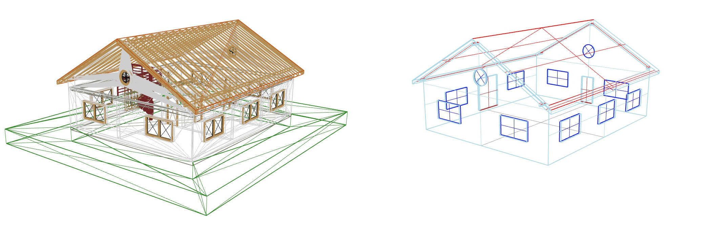
      <figcaption> Een wireframe representatie van een BIM model (links) en een exterieur GIS model (rechts).
      </figcaption>
</figure>


De manier waarop ruimtes binnen het gebouw worden gerepresenteerd zijn daarentegen wel vergelijkbaar tussen BIM en volumetrische GIS modellen. Beide gebruiken een enkele volumetrische vorm om een unieke ruimte binnen een gebouw aan te duiden. Deze volumetrische vorm kan worden gezien als een gesloten schil die de grens tussen het gebouw en de lucht van een ruimte aanduidt of een ruimte in een gebouw.


<figure id="Verschil_IFC_GIS_kamers" style="display: block; text-align: center; margin: 0 auto;">
      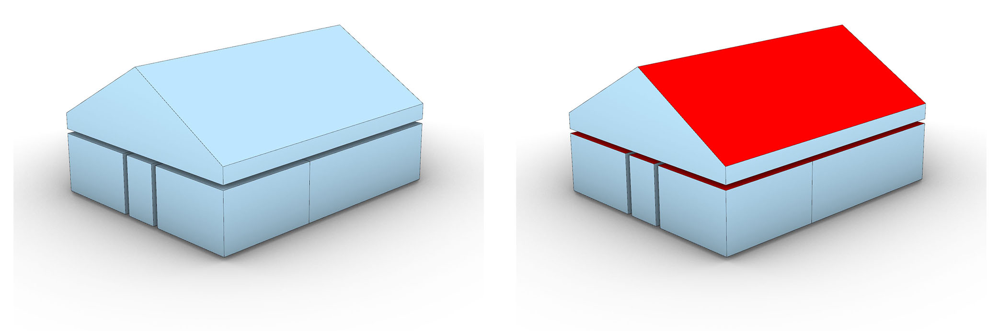
      <figcaption> Representatie van de kamers in een BIM model (links) en GIS model (rechts).
      </figcaption>
</figure>


Over het algemeen is een gebouw in een BIM-bestand op het hoogst beschikbare detailniveau gerepresenteerd. In een GIS-bestand is dit vaak niet het geval. Een gebouw kan op meerde manieren gerepresenteerd worden in een enkel GIS-bestand. Dit kan variëren van (vanuit GIS bezien) zeer gedetailleerde volumetrische vormen tot zeer versimpelde non-volumetrische oppervlakte. Deze variatie in beschikbare representaties is aanwezig om toepassingen op verschillende detailniveaus mogelijk te maken, maar ook omdat GIS data bronnen niet altijd alle data beschikbaar hebben om alle bouwwerken op dezelfde manier te reconstrueren. Het is dus mogelijk om lagere precisie data te combineren met hogere precisie data indien er beperkte data bronnen beschikbaar zijn. Om de verschillende kwaliteit van de representaties aan te duiden wordt de term in GIS, “Level of Detail” (LoD) gebruikt. In BIM is er ook een manier om de granulariteit van decompositie en detail te duiden. Hier voor kan men het Level Of Information Need (LOIN) gebruiken en/of het Level Of Development (LOD) en Level of Detail (LOD) gebruiken. Dat de GIS level of Detail en BIM Level of Detail (LOD) en Level Of Development dezelfde afkorting (LoD) gebruiken zorgt soms voor verwarring. 
 
## Level of Information Need en Level Of Development in BIM
De ISO 19650, de procesnorm voor informatiemanagement, schrijft voor dat in het BIM-werk een Level of Information Need moet worden gedefinieerd. In de EN 17412-1 staat beschreven hoe men dat doet. Voor geometrische informatie worden binnen het BIM-domein afspraken gemaakt over: 

<table>
  <caption> Level Of Information Need aspecten </caption>
  <tr>
    <th style = "width:200px;"> Aspect </th>
    <th style = "width:500px;"> Beschrijving </th>
  </tr>
  <tr>
    <td> 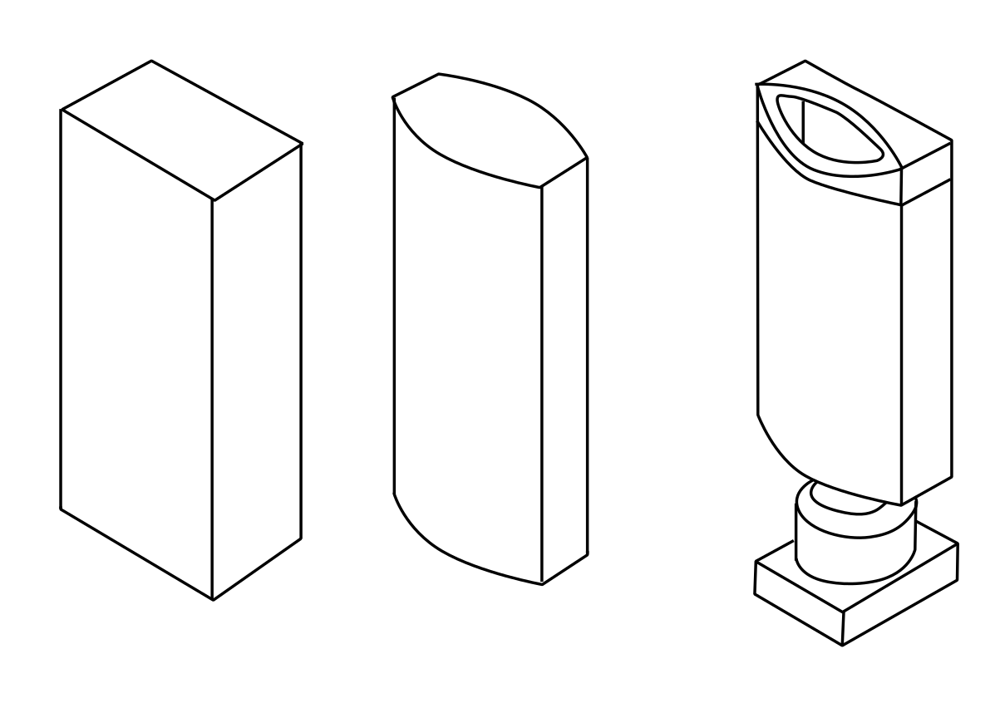 Detail 
    </td>
      <td> Het aspect detail beschrijft de complexiteit van de geometrie van het object in relatie tot het voorkomen van dit object in de echte wereld. </td>
  </tr>
  <tr>
    <td>
       Dimensie
    </td>
      <td> Dit aspect beschrijft de dimensies waarmee een objecten worden weergegeven. Dit kan 0D, 1D, 2D of 3D zijn. Zelfs hogere dimensies zijn mogelijk wanneer bijvoorbeeld tijd, of meting wordt toegevoegd. </td>
  </tr>
  <tr>
    <td>
      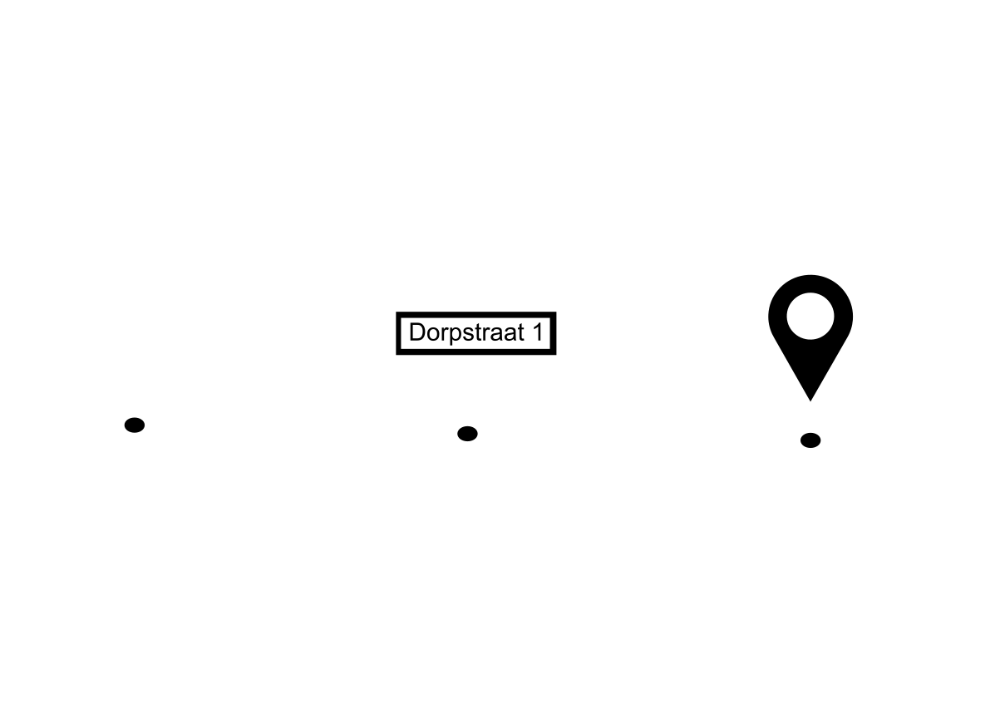 Locatie
    </td>
      <td> Het aspect locatie beschrijft de manier waarop geometrie een locatie heeft. Dit kan absoluut zijn met eigen coordiaten of t.o.v. een ander object. </td>
  </tr>
  </tr>
  <tr>
    <td>
      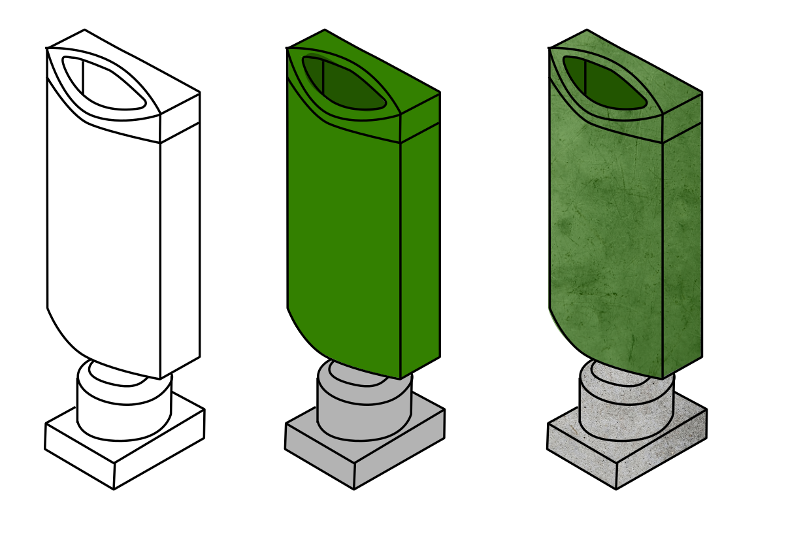 Voorkomen
    </td>
      <td> Het aspect voorkomen beschrijft of het object een kleur of textuur heeft ten opzichte van het voorkomen in de echte wereld. </td>
  </tr>
  <tr>
    <td>
      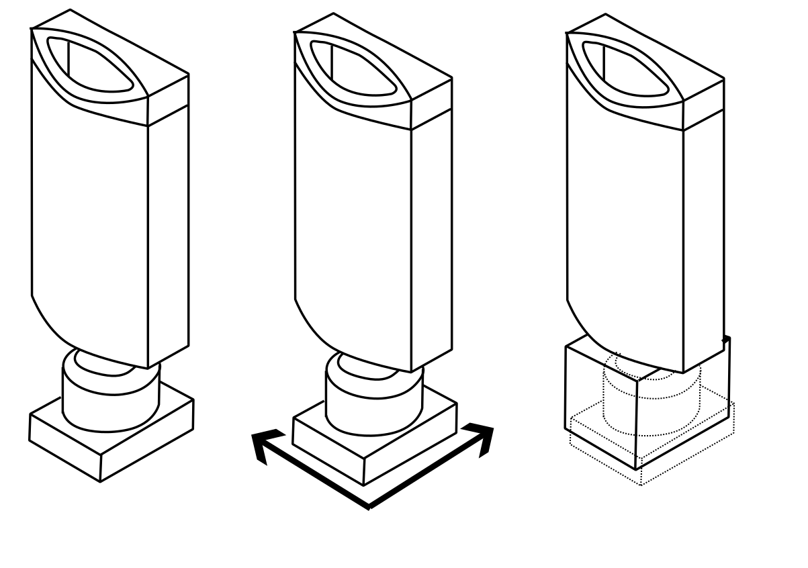 Parametrische Functionaliteit
    </td>
      <td> Dit aspect beschrijft de parametrische functionaliteit die een object heeft. Kan men deze nog aanpassen, en hoe? </td>
  </tr>
</table>

Ook maakt men naast de hierboven genoemde aspecten afspraken over decompositieniveau. Tekent men een afvalbak als één geheel object, bestaat deze uit één losse bak en één losse poer of is deze nog verder gedecomponeerd? 

Naast het hierboven beschreven Level Of Information Need bestaat binnen het BIM-domein het Level Of Development (LOD). Dit Level of Development is gedefinieerd door het American Institue of Architects (AIA) en doorontwikkeld door het [BIMForum](https://bimforum.org/resource/lod-level-of-development-lod-specification/). Dit wordt gebruikt om het ontwikkelniveau aan te duiden van zowel de geometrie als de verbonden informatie in een BIM model. Er bestaan verschillende intrepetaties over hoeveel LOD niveaus er zijn en wat de inhoud hiervan precies betekent. Om hier meer eenduidigheid in te krijgen heeft het BIM-forum een update van de definities gedaan. De ontwikkelniveaus die onderscheiden worden zijn: 

- **LOD100 - Concept niveau**
  - Het model bevat: Generieke massa van een bouwwerk. Oppervlakte, hoogte, inhoud, volume, locatie en orientatie kunnen worden gemodelleerd in 2D, 3D of ander soort data. 
  - Het model is bedoeld voor: Analyse, kostenramingen of planning.
  - Geometrie: Conceptuele massa's van het totaal model en symbolische elementen. Informatie over elementen kunnen afgeleid worden uit andere model elementen (b.v. het aantal verdiepingen kan men afleiden uit een 3D gebouwmodel)  

- **LOD200 - Globale geometrie**
  - Het model bevat: Elementen van het model zijn gemodelleerd als geabstraheerde systemen of samenstellingen met benaderde hoeveelheden, afmetingen, vorm, locatie en orientatie. Niet-geometrische informatie kan aan het model gekoppeld worden. 
  - Het model is bedoeld voor: Analyse, kostenramingen of planning.
  - Geometrie: Gemodelleerde elementen kunnen worden gezien als abstracte ruimtereserveringen, vaak als herkenbaar element. Het afleiden van informatie uit deze modellen is een schatting/benadering. 

- **LOD300 - Nauwkeurige geometry**
  - Het model bevat:  Elementen van het model zijn gemodelleerd als nauwkeurige systemen of samenstellingen met accurate hoeveelheden, afmetingen, vorm, locatie en orientatie. Niet-geometrische informatie kan aan het model gekoppeld worden. 
  - Het model is bedoeld voor: Constructie, analyse, kostenramingen of planning.
  - Geometrie: Gemodelleerde elementen kunnen vanuit het model worden gemeten zonder niet gemodelleerde informatie te raadplegen om tot goed resultaat te komen. Het element heeft de juiste positionering t.o.v. het Project Basepoint. 

- **LOD350 - Nauwkeurige geometry (met aansluiting)**
  - Het model bevat:  Elementen van het model zijn gemodelleerd als nauwkeurige systemen of samenstellingen met accurate hoeveelheden, afmetingen, vorm, locatie en orientatie. En heeft de koppeling naar andere elementen van systemen of samenstellingen. Niet-geometrische informatie kan aan het model gekoppeld worden. 
  - Het model is bedoeld voor: Constructie, analyse, kostenramingen of planning.
  - Geometrie: Onderdelen die nodig zijn voor ondersteuning, verbinding of aansluiting met andere elementen zijn gemodelleerd. Gemodelleerde elementen kunnen vanuit het model worden gemeten zonder niet gemodelleerde informatie te raadplegen om tot goed resultaat te komen. Het element heeft de juiste positionering t.o.v. het Project Basepoint

- **LOD400 – Adapted to realization/ execution**
  - Het model bevat: Elementen van het model zijn gemodelleerd als nauwkeurige systemen of samenstellingen met accurate hoeveelheden, afmetingen, vorm, locatie, orientatie en complete fabricatie, samenstellign en detail informatie. Niet-geometrische informatie kan aan het model gekoppeld worden. 
  - Het model is bedoeld voor: Constructie, analyse, kostenramingen of planning.
  - Geometrie: Onderdelen hebben voldoende detail en nauwkeurigheid voor fabricage/constructie. Onderdelen die nodig zijn voor ondersteuning, verbinding of aansluiting met andere elementen zijn gemodelleerd. Gemodelleerde elementen kunnen vanuit het model worden gemeten zonder niet gemodelleerde informatie te raadplegen om tot goed resultaat te komen. Het element heeft de juiste positionering t.o.v. het Project Basepoint

- **LOD 500 – “as built”**
  - Het model bevat: Elementen van het model zijn gemodelleerd als construeerde samenstellingen met accurate en actuele hoeveelheden, afmetingen, vorm, locatie, orientatie. Niet-geometrische informatie kan aan het model gekoppeld worden. 
  - Het model is bedoeld voor: Generiek gebruik 
  - Geometrie: Dit level is geen "extra level" dat iets extra toevoegt op de voorgaande LOD's, maar is een afronding van alle voorgaande LOD's. Aangevuld met de werkelijke uitvoering van het bouwwerk. 

Elke opvolgende LOD bouwt voort op het vorige level. Een BIM-model kan verschillende LOD's voor verschillende elementen in één model bevatten.  

Voorbeeld van de verschilende LOD's van één kolom.

<figure id="LODS-van-een-kolom" style="display: block; text-align: center; margin: 0 auto;">
      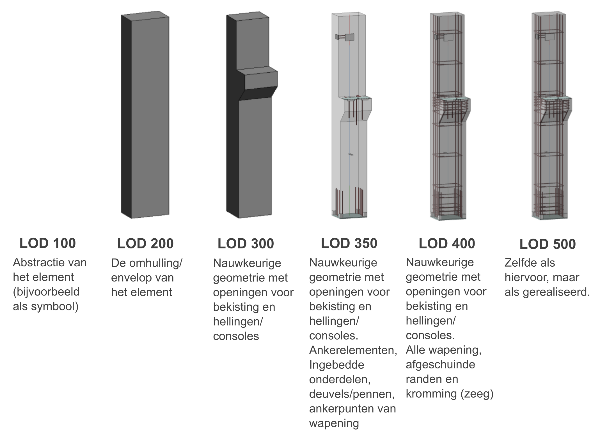
      <figcaption>
        <a class="self-link" href="#fig-LODS-van-een-kolom"></bdi></a>
        <span class="fig-title">
        Verschillende LOD's van een kolom <br> 
        Copyright © 2025 by BIMForum, All rights reserved, CC BY-NC-ND 4.0 <br>
        <a href="https://bimforum.org/resource/lod-level-of-development-lod-specification/" target="_blank">Level of Development (LOD) Specification</a>
        </span>
      </figcaption>
</figure>

Level Of Information Need en Level Of Development vullen elkaar aan. De Levels Of Development kunnen worden gebruikt om het detailniveau van een object te duiden in het LOIN Raamwerk. 

## Level of Detail (LoD) Framework in GIS
In GIS wordt “Level of Detail” gebruikt om aan te geven hoe gedetailleerd de geometrie is van een GIS model. Het onderscheidt zich van BIM Level of Development doordat informatie buiten de geometrie, zoals attributen of documenten van minder belang zijn voor de classificatie. 

De GIS Level Of Details worden gedefinieerd in de [CityGML3.0](https://docs.ogc.org/guides/20-066.html#overview-section-levelsofdetail) standaard. De standaard definieert 4 hoofdniveaus, LOD0 tot LOD3. Hierbij krijgt de geometrie van een model bij hoger LOD niveau meer detail. De hoofdniveaus worden breed ondersteund in toepassingen.

De documentatie van CityGML over LOD is algemeen. Op basis van meerdere bronnen <mark> welke bronnen </mark> kon de volgende definitie worden gegeven ten aanzien van gebouwen:

<table>
  <caption> LoD zoals beschreven als in de CityGML3.0 standaard </caption>
  <tr>
    <th> Level </th>
    <th> Beschrijving </th>
  </tr>
  <tr>
    <td> LoD0 </td>
    <td> Een representatie van een gebouw of vertrek met niet volumetrische geometrie zoals een punt, vlak (polygoon) of meerdere vlakken (voor bijvoorbeeld de 'footprint' of 'roofprint'). </td>    
  </tr>
   <tr>
    <td> LoD1 </td>
    <td>  Een representatie van een gebouw of vertrek als een blok/prisma vorm. </td>    
  </tr>
   <tr>
    <td> LoD2 </td>
    <td> Een representatie van een gebouw of vertrek als een volume met (meestal) verticale muren, waarbij de vlakken die het dak representeren zijn verfijnd. </td>    
  </tr>
   <tr>
    <td> LoD3 </td>
    <td> Een representatie van een gebouw of vertrek als een schil of een collectie van constructieve elementen. Dit is de enige LoD die gevelopeningen ondersteunt. </td>    
  </tr>
</table>


<figure id="Voorbeeld-van-de-4-LoDs-beschreven-door-de-CityGML3-0-standaard" style="display: block; text-align: center; margin: 0 auto;">
      
      <figcaption>
        <a class="self-link" href="#fig-Voorbeeld-van-de-4-LoDs-beschreven-door-de-CityGML3-0-standaard"></bdi></a>
        <span class="fig-title">
        Voorbeeld van de 4 LoDs van een gebouw beschreven door de <a href="https://docs.ogc.org/guides/20-066.html#overview-section-levelsofdetail" target="_blank">CityGML3.0 standaard</a>.
        </span>
      </figcaption>
</figure>

De in CityGML3.0 standaard beschreven LoDs kunnen worden gebruikt voor zowel exterieur als interieur. In CityGML 2.0 was er een aparte LoD die interieur ondersteunde, LoD4. Deze was anders opgebouwd dan LoD0-3. LoD0-3 kent een structuur waarbij de buitenkant een enkele schil is die het model representeert. LoD4 volgt een BIM achtige structuur waarbij de representatie van het gebouw bestaat uit losse objecten. LoD4 kan worden geïnterpreteerd als een (gefilterde) 1:1 conversie van een BIM model.

In CityGML3.0 is de rol van LoD3 veranderd om de BIM achtige structuur te ondersteunen die voorheen onder LoD4 viel. Dit betekent dat LoD3 kan zijn opgebouwd als een schil model maar ook als een collectie van constructieve elementen. Ondanks het feit dat LoD4 officieel niet meer wordt ondersteund, komt het in de praktijk nog voor. In deze modellen is LoD3 opgebouwd als een schil model en LoD4 een als een collectie van constructieve elementen.

Al wordt het niet expliciet genoemd, in de praktijk lijkt het LoD framework vooral toepasbaar op gebouwen. Bouwwerken zoals bruggen, tunnels en sluizen worden in de documentatie niet zo uitgebreid beschreven als gebouwen. In theorie kunnen de LoDs toegepast worden op deze bouwwerken omdat het LoD framework van CityGML open en flexibel is. De verschillend LoD abstracties van infrastructurele bouwwerken lijkt minder bruikbaar. Oorzaak hiervan is dat gebouwen en infrastructuur bouwwerken erg van vorm verschillen. Er zijn wel initiatieven om LoDs van andere type objecten dan gebouwen te definieren, zoals voor [vegetatie](https://repository.tudelft.nl/record/uuid:8b8967a8-0a0f-498f-9d37-71c6c3e532af), [infrastructuur/transport](https://isprs-archives.copernicus.org/articles/XLII-4-W10/89/2018/) en [terrein](https://isprs-annals.copernicus.org/articles/IV-4-W8/75/2019/).

<figure id="Voorbeeld-van-de-4-LoDs-beschreven-door-de-CityGML3-0-standaard-toegepast-op-een-brug-model" style="display: block; text-align: center; margin: 0 auto;">
      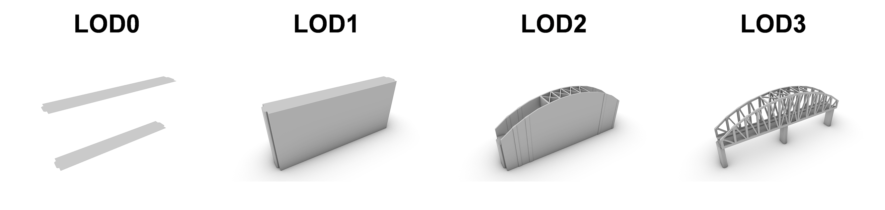
      <figcaption>
        <a class="self-link" href="#fig-Voorbeeld-van-de-4-LoDs-beschreven-door-de-CityGML3-0-standaard-toegepast-op-een-brug-model"></bdi></a>
        <span class="fig-title">
        Voorbeeld van de 4 LoDs beschreven door de <a href="https://docs.ogc.org/guides/20-066.html#overview-section-levelsofdetail" target="_blank">CityGML3.0 standaard</a> toegepast op een brug model.
        </span>
      </figcaption>
</figure>

**Verfijnd LoD framework 3D Geoinformation, TU Delft**

Het CityGML LoD framework is relatief open en generiek. Dit maakt het makkelijk om een model in het framework te passen. Maar maakt het ook moeilijk om vast te stellen hoe een abstractie verschilt van het originele gebouw in de werkelijkheid. In 2016 heeft [Biljecki et al.](https://pure.tudelft.nl/ws/portalfiles/portal/4377508/Biljecki2016to.pdf) daarom een verfijning geschreven die voortbouwt op het CityGML LoD framework. Dit is gedaan door iedere CityGML LoD op te splitsen in 4 sub groepen. Zo wordt bijvoorbeeld LoD1 opgesplitst in LoD1.0, 1.1, 1.2 en 1.3. Het eerste nummer van de verfijnde LoD komt overeen met de CityGML LoD. Het tweede nummer geeft de verdere verfijning aan. De documentatie van de verfijnde LoD is uitgebreider dan die van de CityGML standaard. Maar ontwikkelingen in 3D data inwinning en modellering alsmede gebruik in de praktijk en de zo opgedane ervaringen, leiden voortdurend tot inzichten die de standaard en LoD beschrijvingen zouden kunnen verbeteren.

Op basis van meerdere bronnen kunnen de LoDs van het verfijnde framework op de volgende manier worden gedefinieerd:

<table>
  <caption> Uitbreiding van het LoD Framework </caption>
  <tr>
    <th style = "width:75px;"> Level </th>
    <th> Beschrijving </th>
  </tr>
  <tr>
    <td> LoD0.0 </td>
    <td> Een 2D bounding surface om een gebouw of cluster van gebouwen. </td>
  </tr>
  <tr>
    <td> LoD0.1 </td>
    <td> Een 2D projectie van alle "grote" elementen van een gebouw (>4m, > 10m2) geplaatst op grondniveau. </td>    
  </tr>
  <tr>
    <td> LoD0.2 </td>
    <td> Een 2D projectie van alle elementen van een gebouw geplaatst op grondniveau en optioneel aangevuld door een 2D projectie op dakhoogte.</td>
  </tr>
  <tr>
     <td> LoD0.3 </td>
    <td> Een 2D projectie van alle elementen van een gebouw geplaatst op grondniveau en aangevuld met een 2D projectie van alle losse dakelementen geplaatst op de tophoogte van ieder element. </td>
  </tr>
  <tr>
     <td> LoD1.0 </td>
     <td> Een bounding box om een gebouw of cluster van gebouwen. </td>
  </tr>
  <tr>
     <td> LoD1.2 </td>
     <td> Een opwaartse extrusie van het LoD0.2 grondoppervlak naar de maximale gebouwhoogte (vaak de noklijn), waarbij kleinere details ook worden meegenomen (zoals uitstulpingen). </td>
  </tr>
  <tr>
     <td> LoD1.3 </td>
     <td> Een neerwaartse extrusie van ieder LoD0.3 dakelement, indien deze een minimaal hoogtesprong hebben (bijvoorbeeld 2m) tot grondniveau en samengevoegd tot een enkel volume. </td>
  </tr>
  <tr>
     <td> LoD2.0 </td>
     <td> Een neerwaartse extrusie van ieder groot dak element (>4m, > 10m2) tot grondniveau samengevoegd tot een enkel volume. </td>
  </tr>
  <tr>
     <td> LoD2.1 </td>
     <td> Een neerwaartse extrusie van ieder dak element tot grondniveau samengevoegd tot een enkel volume. Het verschil met LoD2.0 is dat kleine details zoals uitstulpingen (groter dan 2 vierkante meter) ook worden meegenomen </td>
  </tr>
  <tr>
     <td> LoD2.2 </td>
     <td> Een neerwaartse extrusie van ieder dak element en dak bovenbouw (zoals dakkapellen) met minimale omvang tot grondniveau samengevoegd tot een enkel volume. </td>
  </tr>
  <tr>
     <td> LoD2.3 </td>
     <td> LoD2.2 uitgebreid met expliciet gemodelleerde overhang als deze langer is dan bijvoorbeeld 0.2m. In dit geval worden dus de werkelijke geometriën van roofprints en footprints gebruikt, waardoor het volume nauwkeuriger is </td>
  </tr>
  <tr>
     <td> LoD3.0 </td>
     <td> LoD2.2 aangevuld met gedetailleerde informatie over dakstrucuren, zoals ramen op het dak. Dakkapellen of ramen in muren worden niet meegenomen. </td>
  </tr>  
  <tr>
     <td> LoD3.1 </td>
     <td> LoD2.2 aangevuld met gedetailleerde informatie verkregen vanaf de grond (in tegenstelling tot LoD3.0). Deze LoD kan uitkragingen/overhang, ramen en deuren bevatten, met LoD3.2 detail op de gevel (façade). </td>
  </tr>  
  <tr>
     <td> LoD3.2 </td>
     <td> Gedetailleerd schilmodel van het gebouw met elementen die groter zijn dan (bijvoorbeeld) 1m. </td>
  </tr>  
  <tr>
     <td> LoD3.3 </td>
     <td> Gedetailleerd schilmodel van het gebouw met elementen die groter zijn dan (bijvoorbeeld) 0.2m. </td>
  </tr>  
</table>


<figure id="Voorbeeld-van-de-16-LoDs-beschreven-door-de-TUDelft" style="display: block; text-align: center; margin: 0 auto;">
      
      <figcaption>
        <a class="self-link" href="#fig-Voorbeeld-van-de-16-LoDs-beschreven-door-de-TUDelft"></bdi></a>
        <span class="fig-title">
        Voorbeeld van de 16 LoD's beschreven door de  <a href="https://3d.bk.tudelft.nl/lod/" target="_blank">TU Delft</a> in 2016.
        </span>
      </figcaption>
</figure>

Het framework is niet expliciet over het gebruik van een footprint of geprojecteerde dak contour bij de verschillende LoD-representaties. In de documentatie wordt het, in praktijk veel gebruikte, geprojecteerde dak contour bij LoD0.2, LoD0.3 en LoD1.2 genoemd, omdat deze 3D modellen vaak op basis van data inwinning vanuit de lucht worden gegenereerd. Maar het gebruik van de footprint wordt niet uitgesloten. In de praktijk wordt soms ook de footprint contour gebruikt. De footprint-gebaseerde geometrie kan worden uitgebreid naar LoD1.3 en/of 2.2 waar een volumetrische vorm wordt gegenereerd door een opwaartse extrusie van de footprint, welke wordt verfijnd met dakvlakken.

Net zoals bij het CityGML LoD framework is dit framework ontwikkeld voor gebouwen en niet voor infrastructurele bouwwerken zoals bruggen, tunnels en sluizen. In theorie kunnen de LoDs toegepast worden op deze bouwwerken omdat het framework open en flexibel is, maar dit vraagt om verdere verfijningen.

## Uitbreidingen & aanpassingen van de LoD frameworks

Zowel het CityGML LOD Framework als het TU Delft verfijnde framework worden beide gebruikt in de praktijk. Modellen die in de praktijk beschikbaar zijn passen soms niet helemaal op deze LoD frameworks, omdat er recent nieuwe technologieën beschikbaar zijn gekomen die het mogelijk maken om nieuwe data bronnen te gebruiken om GIS modellen te genereren. De CityGML1.0 LoD standaard werd geïntroduceerd in 2008 en versie 3.0 is nog steeds in grote lijnen vergelijkbaar met de 1.0 versie. De TU Delft verfijning is uit 2016. Het is daarom ook belangrijk dat er onderzoek gedaan wordt naar uitbreidingen en aanpassingen van deze twee bestaande LoD frameworks afgestemd op nieuwe mogelijkheden. 
Voor deze praktijkrichtlijn is het met name relevant om te kijken naar BIM als databron voor 3D-GIS-bestanden en hoe en welke bestaande, nieuwe of aangepaste LoDs hiermee kunnen worden gegenereerd. Bij het opstellen van de eerdere frameworks, werd uit gegaan van metingen om de LOD's te vormen.

In 2025 is er onderzoek gedaan naar mogelijke alternatieve LoDs voor GIS modellen die rekening houden met BIM als databron. In de eindrapportage van het onderzoek naar een [BIM2GEO convertor](https://3d.bk.tudelft.nl/pdfs/BIM2GEO_Converter.pdf) vindt men in appendix 7 de implementatie van het TUD LoD framework in de BIM2GEO converter. Er zijn kleine aanpassingen gedaan in het LoD framework zodat men rekening kan houden met de unieke beperkingen, maar vooral ook mogelijkheden van BIM modellen.

<mark> Zou dit een inspiratie kunnen zijn voor een verfijning van de LoDs? zie inwinningsregels https://geonovum.github.io/IMGeo-objectenhandboek/pand </mark>

<aside class="note" title="Gebruik het aangepast BIM naar Geo conversie LoD Framework">
  <p><strong>AANBEVELING:</strong> Gebruik voor BIM naar Geo conversie het aangepast LoD Framework zoals beschreven in de <a href="https://3d.bk.tudelft.nl/pdfs/BIM2GEO_Converter.pdf" target="_blank" rel="noopener"> BIM2GEO Converter eindrapportage</a> </p>
</aside>

<mark>Klopt bovenstaande?</mark>

%% **LoD1 & 1.0 vorm orientatie**

In de CityGML3.0 standaard wordt LoD1 beschreven met "LOD1 – Block model / extrusion objects". Een block model (bounding box) of een extrusie model kunnen, afhankelijk van de vorm van het gebouw, een erg verschillende resulterende vorm hebben. [Biljecki et al.](https://pure.tudelft.nl/ws/portalfiles/portal/4377508/Biljecki2016to.pdf) hebben de LoD1 definitie verfijnt door deze definitie op te splitsen: LoD1.0 is een blokmodel en hogere LoD zoals 1.2 & 1.3 vormen gebazeerd op extrusie. Volgens [Biljecki et al.](https://pure.tudelft.nl/ws/portalfiles/portal/4377508/Biljecki2016to.pdf): " ... LOD1.0 are the coarsest models: they require all buildings larger than 6 m to be acquired, and buildings may be aggregated". De beschrijving van dat dit de grofste modellen zijn, waarbij gebouwen hoger dan 6 meter worden opgenomen maakt duidelijk dat LoD1.0 een blokmodel is, maar deze uitleg is nog steeds incompleet.

<figure id="LOD1-block-model-van-een-BIM-model" style="display: block; text-align: center; margin: 0 auto;">
      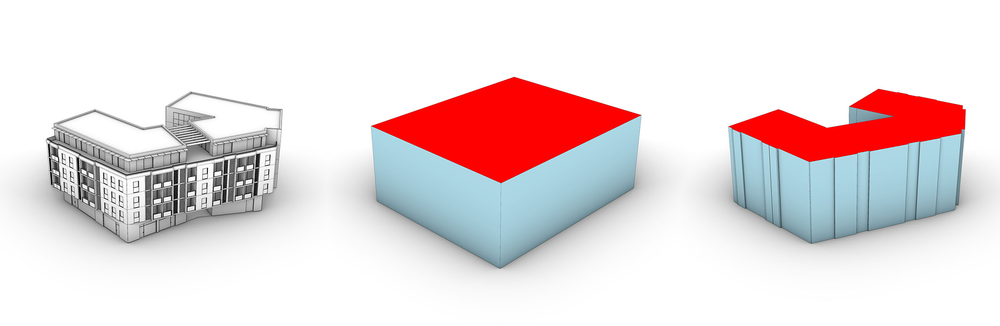
      <figcaption>
        <a class="self-link" href="#fig-LOD1-block-model-van-een-BIM-model"></bdi></a>
        <span class="fig-title">
        Een BIM-model (links) kan men converteren naar een LOD1 block model (midden) en een LOD1 extrusie model (rechts). 
        </span>
      </figcaption>
</figure>

Het is van belang dat de regels die gebruikt dienen te worden bij het ontwikkelen van de blokvorm beter gedefinieerd worden. Bijvoorbeeld, is de blokvorm altijd zo gevormt dat de zijvlakken evenwijdig zijn aan de noord/zuid en oost/west assen van het coordinaatreferentiestelsel? Dit zou kunnen resulteren in een significante overschatting van het volume van het gerepresenteerde model. Voor de hand liggend zou zijn om LoD1.0 te modelleren als een kleinste bounding box geroteerd rond de z-as. Mogelijk is dit ook de representatie die bedoelt wordt in de CityGML standaard met de term blokvorm. Dit staat echter nergens expliciet gedefinieerd.

<figure id="LOD1-verschil-tussen-de-oriëntatie-van-een-bounding-box" style="display: block; text-align: center; margin: 0 auto;">
      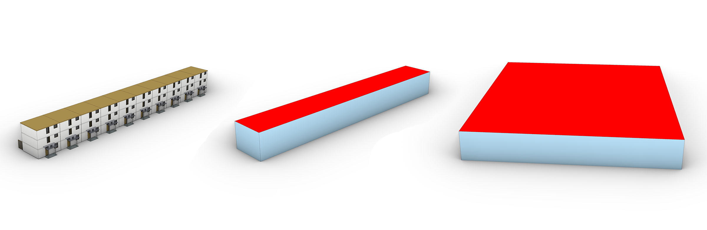 
      <figcaption>
        <a class="self-link" href="#fig-LOD1-verschil-tussen-de-oriëntatie-van-een-bounding-box"></bdi></a>
        <span class="fig-title">
        Een BIM-model (links) kan men converteren naar een kleinste bounding box geroteerd rond de z-as (midden) en een boundingbox die noord/west georiënteerd is (rechts). Het verschil van beide vormen in dit voorbeeld is 31.346m<sup>3</sup> 
        </span>
      </figcaption>
</figure>

<aside class="note" title="Maak aanvullende afspraken rondom vorm en orientatie voor conversie">
  <p><strong>AANBEVELING:</strong> Maak aanvullende afspraken rondom het converteren van vorm en orientatie voor BIM naar GEO conversie. Voor vorm zou dit kunnen zijn: LoD1.0 is een bounding box model georiënteerd rond de z-as. 
</aside>

%%

**Voetafdruk of dak omtrek als bron**

LoD1, 2, 1.2, 1.3, 2.1, 2.2 en 2.3 zijn vormen die gemaakt zijn door een oppervlak te extruderen. Het is van belang dat gespecificeerd wordt welke oppervlaktes de beperkende oppervlaktes voor deze vorm zijn. Een model dat gebaseerd is op de voetafdruk zal in de meeste gevallen een andere vorm hebben dan als het model is gebaseerd op de dak omtrek. Veel gebouwen hebben een dak dat over de gevel (en de voetafdruk) heen uitsteekt. Bij deze gebouwen zal een extrusie gebaseerd op de dak omtrek dus groter uitvallen dan een extrusie gebaseerd op de voetafdruk.

Opvallend is dat voor ruimtes de CityGML3.0 standaard wel erg duidelijk is: "LOD 1: Volumetric real-world objects (Spaces) are spatially represented by a vertical extrusion solid, i.e., a solid created from a horizontal footprint by vertical extrusion. A real real-world objects (Space Boundaries) can be spatially represented in LOD1 by a set of horizontal or vertical surfaces.". Hier wordt duidelijk de voetafdruk genoemd, als bronoppervlak voor de extrusie. Voor de buitenschil is de CityGML standaard en [Biljecki et al.](https://pure.tudelft.nl/ws/portalfiles/portal/4377508/Biljecki2016to.pdf) een stuk onduidelijker: "LOD0 is a representation of footprints and optionally roof edge polygons marking the transition from 2D to 3D GIS. LOD1 is a coarse prismatic model usually obtained by extruding an LOD0 model.". Op basis van deze text zou een LoD1 zowel gebaseerd kunnen zijn op de voetafdruk als de dak omtrek. Een aantal uitbreidingen voor LoD1.2, 1.3 en de 2.x groep worden beschreven, maar dit gaat niet in op wat de beperkende bron voor de extrusie is.

<figure id="Verschil-tussen-footprint-roofedge" style="display: block; text-align: center; margin: 0 auto;">
      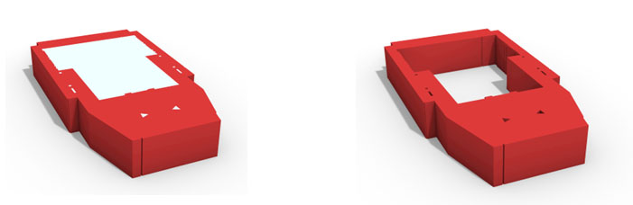 
      <figcaption>
        <a class="self-link" href="#fig-LOD1-verschil-tussen-de-oriëntatie-van-een-bounding-box"></bdi></a>
        <span class="fig-title">
        LoD1.2 representatie van het aula gebouw van de TU Delft gebaseerd op de dakomtrek (Links). Met rood is het deel is aangeven dat zou vervallen ten opzicht van een voetafdruk gebaseerde extrusie. Het vervallende deel is rechts geïsoleerd weergegeven. Het verschil in volume tussen de twee resulterende vormen is ongeveer 54.000m<sup>3</sup> 
        </span>
      </figcaption>
</figure>

Deze onduidelijkheid komt ook naar voren bij implementaties van deze frameworks. Zo is het 2DBAG/3DBAG inconsistent in de toepassing van het [Biljecki et al.](https://pure.tudelft.nl/ws/portalfiles/portal/4377508/Biljecki2016to.pdf) framework. Op het faculteitsterrein van de TU Delft staan twee gebouwen waarbij duidelijk is dat één gebaseerd is op de dak omtrek en de ander op de voetafdruk.

<figure id="Voorbeeld-verschil-bronoppervlak-extrusie-3DBAG" style="display: block; text-align: center; margin: 0 auto;">
       
      <figcaption>
        <a class="self-link" href="#fig-Voorbeeld-verschil-bronoppervlak-extrusie-3DBAGx"></bdi></a>
        <span class="fig-title">
        Voorbeeld van het verschillende gebruik van bronoppervlaktes voor de extrusie in het 3DBAG. Links in de figuur is de aula van de TU Delft gevisualiseerd, de 3DBAG representatie van dit gebouw is duidelijk gebaseerd op de dak omtrek. Rechts is gebouw Echo, de twee halfronde kokers aan de voorgevel in de 3DBAG representatie duiden aan dat de voetafdruk, waarin de draaideuren van de entree zijn gerepresenteerd, is gebruikt als basis voor de extrusie. Beide 3DBAG representaties zijn LoD2.2
        </span>
      </figcaption>
</figure>

<mark> foto's aanpassen </mark>

<!-- De fotos van de gebouwen moet worden verwisseld met eigen fotos -->

<!-- meer voorbeelden? -->

Zowel de voetafdruk als de dak omtrek zijn bruikbaar, maar op dit moment is het vaak onduidelijk voor de gebruiker welk oppervlak als bron voor de extrusie wordt gebruikt.

<aside class="note" title="Maak aanvullende afspraken rondom voetafdruk of dakomtrek">
  <p><strong>AANBEVELING:</strong> Maak aanvullende afspraken rondom het converteren van voetafdruk of dakomtrek voor BIM naar GEO conversie en gebruik dit consistent in implementaties. Maak kenbaar welk oppervlak als bron gebruikt wordt.  
</aside>

# Bestandsformaten

Wanneer men een conversie wil doen van open BIM naar open GEO kan men van verschillende bestandsformaten gebruik maken. Hieronder zijn een aantal belangrijke bestandsformaten beschreven voor het converteren van open BIM naar open GEO beschreven.

## CityGML XML & CityGML CityJSON

CityGML is een open conceptueel datamodel voor het opslaan van 3D Geo data. CityGML defineert verschillende objecten (classes) en hun relaties voor de meest relevante topografische objecten zoals gebruikt in stedelijke en regionale modellen. In tegenstelling tot mesh bestand types zoals OBJ en STL maakt CityGML het mogelijk om ook attributen voor ieder object op te slaan.

Naast een datamodel is CityGML ook een data encoding. De gelijke benaming van het datamodel en data encoding kan tot verwarring leiden. Voor het conceptuele data model CityGML, is zowel een CityGML, JSON en linked data encoding beschikbaar.

De GML encoding is gebaseerd op een XML datamodel. XML is een vrij zwaar datatype wat ook lastig is om te lezen door gebruikers. Een alternatief is [CityJSON](https://3d.bk.tudelft.nl/opendata/cityjson/3dcities/v2.0/DenHaag_01.city.json), een encoding gebaseerd op een JSON datamodel. Deze encoding is lichter dan XML en ook makkelijker door gebruikers te begrijpen. Een CityGML bestand in de XML encoding is ongeveer 7 keer zwaarder dan een CityGML bestand in de CityJSON encoding (zie tabel hieronder en zie [CityJSON bestandsgrootte](https://www.cityjson.org/filesize/) voor meer informatie). CityJSON komt echter ook met beperkingen. Zo is niet het gehele CityGML datamodel in de CityJSON encoding beschikbaar. Ook is CityJSON vatbaarder voor niet standaard gebruik.

Er is software beschikbaar die CityGML bestanden van de ene naar de andere encoding kan omzetten, waardoor afhankelijk van de toepassing de ene of de andere encodig kan worden gebruikt.

| dataset | CityJSON v2.0 | CityGML-XML v3.0 | textures | compression |
|-|-|-|-|-|
| 3DBAG      | 7.0MB | 40MB    | none | **5.7X**   |
| Den Haag   | 2.7MB | 19MB    | none | **7.0X**   |
| Ingolstadt | 4.8MB | 40MB    | none | **8.3X**   |
| Montréal   | 5.6MB | 53MB   | none | **9.5X**   |
| New York   | 110MB | 682MB  | none | **6X**     |
| Railway    | 4.5MB | 39MB   | ZIP | **8.7X**   |
| Rotterdam  | 2.7MB | 18MB   | ZIP  | **6.7X**   |
| Vienna     | 5.6MB | 40MB   | ZIP  | **7.1X**   |
| Zürich     | 293MB | 2100MB | none  | **7X**     |

In de onderstaande code fragmenten kan de [XML](https://3d.bk.tudelft.nl/opendata/cityjson/3dcities/citygml/DenHaag_01.xml) (boven) en [CityJSON](https://3d.bk.tudelft.nl/opendata/cityjson/3dcities/v2.0/DenHaag_01.city.json) (onder) encoding van CityGML vergeleken worden. Deze twee fragmenten laten de definitie zien van hetzelfde object met een aantal attributen. De geometrie is verwijderd uit de fragmenten. Het is duidelijk te zien dat de XML encoding veel meer karakters nodig heeft om dezelfde informatie over te brengen. Dit draagt bij aan de extra bestandsgrootte.

```xml
<cityObjectMember>
	<bldg:Building gml:id="GUID_DBDABF53-7DD5-4C2F-BE7F-51F29A0CBA16">
		<gml:name>{DBDABF53-7DD5-4C2F-BE7F-51F29A0CBA16}</gml:name>
		<bldg:consistsOfBuildingPart>
	<bldg:BuildingPart gml:id="GUID_DBDABF53-7DD5-4C2F-BE7F-51F29A0CBA16_1">
		<gml:name>{DBDABF53-7DD5-4C2F-BE7F-51F29A0CBA16}</gml:name>
		<gen:doubleAttribute name="RelativeEavesHeight"><gen:value>3.133</gen:value></gen:doubleAttribute>
		<gen:doubleAttribute name="AbsoluteEavesHeight"><gen:value>7.717</gen:value></gen:doubleAttribute>
		<gen:doubleAttribute name="RelativeRidgeHeight"><gen:value>3.133</gen:value></gen:doubleAttribute>
		<gen:doubleAttribute name="AbsoluteRidgeHeight"><gen:value>7.717</gen:value></gen:doubleAttribute>

            ...

    </bldg:BuildingPart>
</cityObjectMember>
```

```json
"GUID_DBDABF53-7DD5-4C2F-BE7F-51F29A0CBA16_1": {
    "type": "BuildingPart",
    "attributes": {
        "roofType": "1000",
        "RelativeEavesHeight": 3.133,
        "RelativeRidgeHeight": 3.133,
        "AbsoluteEavesHeight": 7.717,
        "AbsoluteRidgeHeight": 7.717
    },

    ...

}
```

Meer informatie over CityGML kan worden gevonden op de [OGC website](https://www.ogc.org/standards/citygml/). OGC heeft het data model voor de GML/XML encoding ontwikkeld. De CityJSON encoding is ontwikkeld onder leiding van de TU Delft en is later door OGC vastgesteld als community standaard. Meer over CityJSON kan worden gevonden op de [CitySJON website](https://www.cityjson.org/).

## GeoJSON

GeoJSON is een datamodel voor het uitwisselen van geospatiale gegevens. Het is, net zoals CityGML CityJSON, gebaseerd op de JSON encoding. De manier waarop de data is opgeslagen is echter anders. Ten opzichte van CityGML heeft GeoJSON meer beperkingen. Maar, de GeoJSON bestanden zijn over het algemeen minder zwaar en worden door meer GIS applicaties ondersteunt dan CityJSON.

```json

"type": "Feature",
    "properties": {
    "objectID": "GUID_DBDABF53-7DD5-4C2F-BE7F-51F29A0CBA16_1 Park",
    "roofType": "1000",
    "RelativeEavesHeight": 3.133,
    "RelativeRidgeHeight": 3.133,
    "AbsoluteEavesHeight": 7.717,
    "AbsoluteRidgeHeight": 7.717
    },

      ...
}
```

## IFC

De Industry Foundation Classes (IFC) zijn een set van gestandaardiseerde, digitale beschrijvingen van de gebouwde omgeving voor Bouw Informatie Modellen (BIM). IFC is een open internationale standaard voor het delen van data van de gebouwde omgeving. De standaard bevat definities voor data die benodigd is voor gebouwen en infrastructurele werken over de gehele levenscyclus bezien. De standaard wordt voornamelijk gebruikt in de Architectuur, Engineering en Constructie (AEC) industrie. IFC bestaat uit een schema, een documentatie, property (kenmerken) en quantity (hoeveelheden) sets en het mechanisme van het uitwisselformaat. IFC biedt machine-interpreteerbare informatie en maakt daarmee automatisering van workflows mogelijk. Het is software-onafhankelijk en voor iedereen beschikbaar. Binnen het formaat is het mogelijk om Gebouwen, Wegen, Spoor, Waterwegen en Havenfaciliteiten te modelleren. 

In deze praktijrichtlijn wordt de BIM naar GEO workflow beschreven voor open uitwisseling van BIM en GEO. Hiervoor baseert de praktijkrichtlijn zich voornamelijk op IFC uitwisselformaat voor BIM en CitGML (JSON-encoding) voor GEO. 

## 3D Tiles

Voor het grootschalig streamen en renderen van BIM-modellen is de OGC standaard [3D Tiles](https://www.ogc.org/standards/3dtiles/) te gebruiken. Het formaat kan automatisch schakelen naar verschillende Level of Detail. Deze standaard is niet bedoeld voor het modelleren of analyseren van modellen. glTF en het binary formaat daarvan, GLB is het primaire tegelformaat voor 3D Tiles. Het is mogelijk om attribuutinformatie mee te nemen in dit bestandsformaat, maar dient vanwege de snelheid van streamen en renderen zoveel mogelijk beperkt te blijven. Wanneer dit van belang is kan men beter een bestandsformaat als CityJSON kiezen. 

zie [handreiking 3D Tiling](https://docs.geostandaarden.nl/3d/3d-tiling/) en zie convertors als [ifc2b3dm](https://github.com/Erfan-Shooraj/ifc2b3dm) 


er zijn ook betaalde converters of add-ins [cesium revit add in](https://cesium.com/blog/2024/12/03/cesium-design-tiler-and-revit-add-in/)


