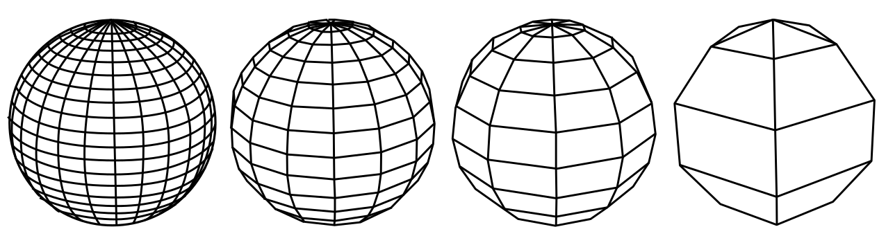

# Geometrie BIM naar GEO

## Impliciete en expliciete geometrie
Geometrie van BIM en GEO kan impliciet of expliciet zijn. Impliciete geometrie is geometrie die volledig is uitgeschreven, zoals alle coördinaten van de vertices, edges, faces en curves. Er is geen procedure of wiskundige berekening nodig om de geometrie op te stellen. Bij impliciete geometrie is dit anders. De geometrie is beschreven als een wiskundige of procedurele definitie. Pas bij rendering of conversie wordt geometrie vertaald naar vertices, edges, faces en curves. 
In het open-BIM-formaat IFC, kan men zowel impliciete als expliciete geometry opslaan. Een software-gebruiker is zich niet altijd bewust van het gemodelleerde geometrie-formaat. In de GEO-formaten CityJSON, CityGML en GeoJSON maakt men voornamelijk gebruik van impliciete geometrie. Dit maakt het schema van Geo een stuk compacter dan dat van IFC. Complexe expliciete geometry kan bij conversie naar impliciete CityJSON geometrie een groot bestandsformaat opleveren.  

<figure id="drie_benaderingen_IFC_geometrie" style="display: block; text-align: center; margin: 0 auto;">
      
      <figcaption>
        <a class="self-link" href="#fig-drie_benaderingen_IFC_geometrie"></bdi></a>
        
        Drie verschillende benaderingen soorten geometrie in IFC   
        bron:
        <a href="https://resolver.tudelft.nl/uuid:31380219-f8e8-4c66-a2dc-548c3680bb8d" target="_blank">Automatic generation of CityGML LoD3 building models from IFC models</a> S. Donkers
        
      </figcaption>
</figure>

## Meshing
De geometriën van het BIM-model wordt vertaald naar Geo-geometriën. Waar nodig worden ifc-geometrieën omgezet naar solids of polygonen. Dit kan op verschillende detailniveaus. Een hoger detailniveau resulteert in een nauwkeurigere representatie en vergroot de bestandsgrootte.

<figure id="Mesh_van_Geometrie" style="display: block; text-align: center; margin: 0 auto;">
      
    <figcaption><a class="self-link" href="#fig-Mesh_van_Geometrien"></bdi></a>Meshing van dezelfde geometrie op verschillend detailniveau</figcaption>
</figure>

## Shell extractie

Zoals eerder beschreven is shell extractie vooral nog een experimentele vorm van BIM naar GIS brengen. Hierdoor zijn er nog geen standaard methodes ontwikkeld en gebruikt iedere software een eigen benadering. Dit hoofdstuk beschrijft de verschillende manieren waarop sommige schil modellen worden gemaakt door software. Dit is een selectie van de processen om een visualisatie te creëren van de complexheid van BIM naar GEO conversie.

### Voxelisatie

Een alternative shell extractie methode die wordt gebruikt is voxelisatie. Voxelisatie benaderd de vorm van een gebouw/bouwwerk met behulp van VOlumetriche piXELS (voxels). De resulterende vorm kan worden gezien als een blokkendoos representatie van het input model. Dit is op dit moment geen standaard GIS vorm die wordt ondersteund door de geaccepteerde LoD frameworks. Echter wordt dit wel als belangrijk beschouwd. Voxelisatie kan namelijk aspecten van een gebouw opslaan die verder alleen in hele complexe LoD modellen beschikbaar is (LoD3+), zoals overhang en gevelopeningen.

Voxelisatie komt echter met unieke problemen waarvoor nog geen standaard methode voor is opgesteld. Zo is de vorm van het gevoxeliseerde model afhankelijk van de voxelgrootte en de rotatie van de grid dat gebruikt werd tijdens de voxelisatie.

<!-- niet standaard, wel handig -->
<!-- voxelgrootte en rotatie -->
<!-- onbetrouwbare data -->

### Hoge resolutie schil

<!-- verschil in pre-filtering, classe selectie, voxel filtering -->
<!-- verschil in output van een enkele tool -->
<!-- verschil in surface detection, ray casting, voxel assisted ray casting, alpha shapes -->