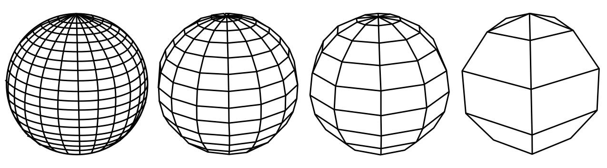
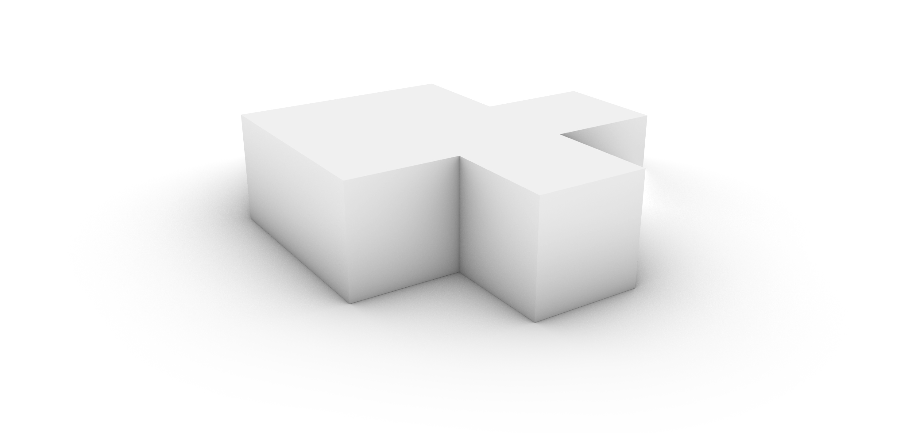

# Geometrie BIM naar GEO

## Impliciete en expliciete geometrie
Geometrie van BIM en GEO kan impliciet of expliciet zijn. Impliciete geometrie is geometrie die volledig is uitgeschreven, zoals alle coördinaten van de vertices, edges, faces en curves. Er is geen procedure of wiskundige berekening nodig om de geometrie op te stellen. Bij impliciete geometrie is dit anders. De geometrie is beschreven als een wiskundige of procedurele definitie. Pas bij rendering of conversie wordt geometrie vertaald naar vertices, edges, faces en curves. 
In het open-BIM-formaat IFC, kan men zowel impliciete als expliciete geometry opslaan. Een software-gebruiker is zich niet altijd bewust van het gemodelleerde geometrie-formaat. In de GEO-formaten CityJSON, CityGML en GeoJSON maakt men voornamelijk gebruik van impliciete geometrie. Dit maakt het schema van Geo een stuk compacter dan dat van IFC. Complexe expliciete geometrie kan bij conversie naar impliciete CityJSON geometrie een groot bestandsformaat opleveren.  

<figure id="drie_benaderingen_IFC_geometrie" style="display: block; text-align: center; margin: 0 auto;">
      
      <figcaption>
        <a class="self-link" href="#fig-drie_benaderingen_IFC_geometrie"></bdi></a>
        
        Drie verschillende benaderingen soorten geometrie in IFC   
        bron:
        <a href="https://resolver.tudelft.nl/uuid:31380219-f8e8-4c66-a2dc-548c3680bb8d" target="_blank">Automatic generation of CityGML LoD3 building models from IFC models</a> S. Donkers
        
      </figcaption>
</figure>

## Meshing
De geometriën van het BIM-model wordt vertaald naar Geo-geometriën. Waar nodig worden ifc-geometrieën omgezet naar solids of polygonen. Dit kan op verschillende detailniveaus. Een hoger detailniveau resulteert in een nauwkeurigere representatie en vergroot de bestandsgrootte.

<figure id="Mesh_van_Geometrie" style="display: block; text-align: center; margin: 0 auto;">
      
    <figcaption><a class="self-link" href="#fig-Mesh_van_Geometrien"></bdi></a>Meshing van dezelfde geometrie op verschillend detailniveau</figcaption>
</figure>

## Shell extractie
Zoals eerder beschreven is shell extractie nu nog veelal beschikbaar in experimentele vorm voor het van BIM naar GIS brengen. Hierdoor zijn er nog geen standaard methodes ontwikkeld en gebruikt iedere software een eigen benadering. Dit hoofdstuk beschrijft de verschillende manieren waarop sommige schil modellen worden gemaakt door software. Dit is een selectie van de processen om een complex BIM model te converteren naar een versimpeld GEO model.

### Voxelisatie
Een shell extractie methode die wordt gebruikt is voxelisatie. Voxelisatie benadert de vorm van een gebouw/bouwwerk met behulp van VOlumetriche piXELS (voxels). De resulterende vorm kan worden gezien als een blokkendoos representatie van het input model. Dit is op dit moment geen standaard GIS vorm die wordt ondersteund door de geaccepteerde LoD frameworks. Echter wordt dit wel als belangrijke output beschouwd. Voxelisatie kan namelijk aspecten van een gebouw opslaan die verder alleen in hele complexe LoD modellen beschikbaar is (LoD3+), zoals overhang en gevelopeningen. Voxelistatie is minder precies dan deze LoD3+ modellen maar het is wel een stuk robuuster en sneller. Daar waar een LoD3+ vorm niet gemaakt kan worden door een schil extractor kan mogelijk een voxelistatie wel gemaakt worden.

Voxelisatie komt met unieke problemen waarvoor nog geen standaard methode voor is opgesteld. Zo is de vorm van het gevoxeliseerde model afhankelijk van de voxelgrootte en de rotatie van de grid dat gebruikt werd tijdens de voxelisatie.

[Van der Vaart et. all](https://isprs-annals.copernicus.org/articles/X-4-W5-2024/297/2024/) beschrijven het effect van verschillende voxelgrootte op het volume en oppervlakte van een extrene schil representatie van een IFC model. Hieruit komt naar voren dat voor het oppervlakte van de voetafdruk, het volume van de gehele schil en de visuele representatie beter wordt benaderd met kleinere voxels. Als de voxelgrootte correct wordt gekozen is de voxel vorm ook preciser in deze opzichten dan LoD2.2 representaties.

Op basis van de groote van een model wordt een "ideale" voxelgrootte gepresenteerd door [Van der Vaart et. all](https://isprs-annals.copernicus.org/articles/X-4-W5-2024/297/2024/). Deze waardes zijn mogelijk al verouderd, zo zijn elementen zoals bestandsgrootte niet meegenomen en ook is het onderzoek is gedaan met een oude versie van de [IfcEnvelopeExtractor](ttps://github.com/tudelft3d/IFC_BuildingEnvExtractor). Sinds dit onderzoek is de voxelisatie code versneld en dus is de process snelheid niet meer relevant in het onderzoek. 

<figure>
  
  <figcaption>Animatie die het effect op de resulterende voxel schil laat zien bij verfijning van de gekozen voxelgrootte. De grootte gaat van 21.78m naar 0.09m door bij iedere stap de voxelgrootte door twee the delen. Het input model is het Schependomlaan model.</figcaption>
</figure>

<!-- rotatie -->

### Hoge resolutie schil

<!-- verschil in pre-filtering, classe selectie, voxel filtering -->
<!-- verschil in output van een enkele tool -->
<!-- verschil in surface detection, ray casting, voxel assisted ray casting, alpha shapes -->
