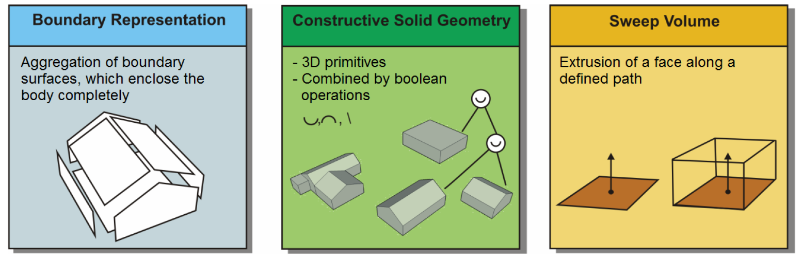
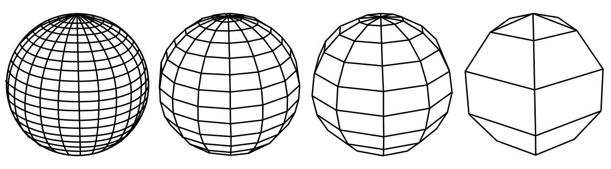
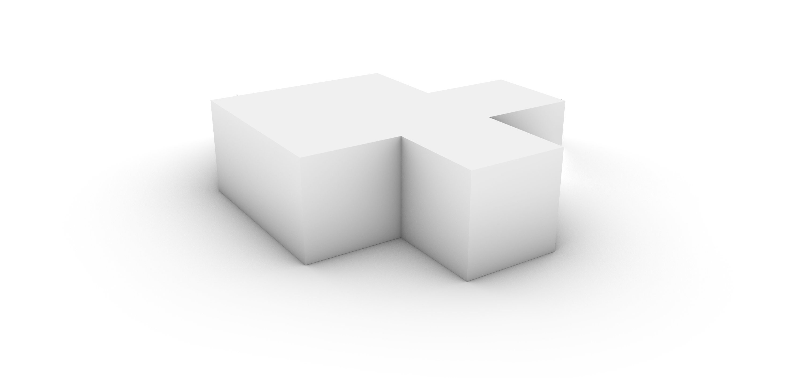

# Geometrie BIM naar GEO

## Impliciete en expliciete geometrie
Geometrie van BIM en GEO kan impliciet of expliciet zijn. Impliciete geometrie is geometrie die volledig is uitgeschreven, zoals alle coördinaten van de vertices, edges, faces en curves. Er is geen procedure of wiskundige berekening nodig om de geometrie op te stellen. Bij impliciete geometrie is dit anders. De geometrie is beschreven als een wiskundige of procedurele definitie. Pas bij rendering of conversie wordt geometrie vertaald naar vertices, edges, faces en curves. 
In het open-BIM-formaat IFC, kan men zowel impliciete als expliciete geometry opslaan. Een software-gebruiker is zich niet altijd bewust van het gemodelleerde geometrie-formaat. In de GEO-formaten CityJSON, CityGML en GeoJSON maakt men voornamelijk gebruik van impliciete geometrie. Dit maakt het schema van Geo een stuk compacter dan dat van IFC. Complexe expliciete geometrie kan bij conversie naar impliciete CityJSON geometrie een groot bestandsformaat opleveren.  

<figure id="drie_benaderingen_IFC_geometrie" style="display: block; text-align: center; margin: 0 auto;">
      
      <figcaption>
        <a class="self-link" href="#fig-drie_benaderingen_IFC_geometrie"></bdi></a>
        
        Drie verschillende benaderingen soorten geometrie in IFC   
        bron:
        <a href="https://resolver.tudelft.nl/uuid:31380219-f8e8-4c66-a2dc-548c3680bb8d" target="_blank">Automatic generation of CityGML LoD3 building models from IFC models</a> S. Donkers
        
      </figcaption>
</figure>

## Meshing
De geometriën van het BIM-model wordt vertaald naar Geo-geometriën. Waar nodig worden ifc-geometrieën omgezet naar solids of polygonen. Dit kan op verschillende detailniveaus. Een hoger detailniveau resulteert in een nauwkeurigere representatie en vergroot de bestandsgrootte.

<figure id="Mesh_van_Geometrien_2" style="display: block; text-align: center; margin: 0 auto;">
      
    <figcaption><a class="self-link" href="#fig-Mesh_van_Geometrien_2"></bdi></a>Meshing van dezelfde geometrie op verschillend detailniveau</figcaption>
</figure>

## Shell extractie
Zoals eerder beschreven is shell extractie nu nog veelal beschikbaar in experimentele vorm voor het van BIM naar GIS brengen. Hierdoor zijn er nog geen standaard methodes ontwikkeld en gebruikt iedere software een eigen benadering. Dit hoofdstuk beschrijft de verschillende manieren waarop sommige schil modellen worden gemaakt door software. Dit is een selectie van de processen om een complex BIM model te converteren naar een versimpeld GEO model.

### Voxelisatie
Een shell extractie methode die wordt gebruikt is voxelisatie. Voxelisatie benadert de vorm van een gebouw/bouwwerk met behulp van VOlumetriche piXELS (voxels). De resulterende vorm kan worden gezien als een blokkendoos representatie van het input model. Dit is op dit moment geen standaard GIS vorm die wordt ondersteund door de geaccepteerde LoD frameworks. Echter wordt dit wel als belangrijke output beschouwd. Voxelisatie kan namelijk aspecten van een gebouw opslaan die verder alleen in hele complexe LoD modellen beschikbaar is (LoD3+), zoals overhang en gevelopeningen. Voxelistatie is minder precies dan deze LoD3+ modellen maar het is wel een stuk robuuster en sneller. Daar waar een LoD3+ vorm niet gemaakt kan worden door een schil extractor kan mogelijk een voxelistatie wel gemaakt worden.

Voxelisatie komt met unieke problemen waarvoor nog geen standaard methode voor is opgesteld. Zo is de vorm van het gevoxeliseerde model afhankelijk van de voxelgrootte en de rotatie van de grid dat gebruikt werd tijdens de voxelisatie.

[Van der Vaart et. all](https://isprs-annals.copernicus.org/articles/X-4-W5-2024/297/2024/) beschrijven het effect van verschillende voxelgrootte op het volume en oppervlakte van een externe schil representatie van een IFC model. Hieruit komt naar voren dat voor het oppervlakte van de voetafdruk, het volume van de gehele schil en de visuele representatie beter wordt benaderd met kleinere voxels. Als de voxelgrootte correct wordt gekozen is de voxel vorm ook preciser in deze opzichten dan LoD2.2 representaties.

Op basis van de grootte van een model wordt een "ideale" voxelgrootte gepresenteerd door [Van der Vaart et. all](https://isprs-annals.copernicus.org/articles/X-4-W5-2024/297/2024/). Deze waardes zijn mogelijk al verouderd, zo zijn elementen zoals bestandsgrootte niet meegenomen en ook is het onderzoek is gedaan met een oude versie van de [IfcEnvelopeExtractor](ttps://github.com/tudelft3d/IFC_BuildingEnvExtractor). Sinds dit onderzoek is de voxelisatie code versneld en dus is de process snelheid niet meer relevant in het onderzoek. 

<figure>
  
  <figcaption>Animatie die het effect op de resulterende voxel schil laat zien bij verfijning van de gekozen voxelgrootte. De grootte gaat van 21.78m naar 0.09m door bij iedere stap de voxelgrootte door twee the delen. Het input model is het Schependomlaan model.</figcaption>
</figure>

<!-- rotatie -->

### Hoge resolutie schil
Een hoge resolutie schil kan worden op een aantal verschillende manieren worden gemaakt. De meest algemene technieken zijn ray-casting en alpha shapes.

#### Ray casting

Ray-casting is een process waarbij rechte lijnen (rays) worden gebruikt om te testen of een polygoon deel uitmaakt van de buitenschil van een gebouw. Het resultaat van een ray-casting proces is echter niet direct een correct gesloten buitenschil. Na een ray-casting proces is extra correctie nodig om een gesloten buitenschil te maken. Zo kunnen de resulterende polygonen maar gedeeltelijk deel uitmaken van de buitenschil of kleine openingen bevatten.

De eerste stap van een ray-casting process is punten populatie. In de meest simpele vorm van ray-casting worden alle polygonen van een model bedekt met punten. Vanaf deze punten worden 1, of meer, lijnen getrokken in de globale normaal richting van de polygoon. Voor iedere lijn wordt er getest of de lijn met andere polygonen van het model gesneden worden. Als een lijn niet word gesneden dan is het punt "zichtbaar" vanaf de buitenkant van het gebouw, en dus maakt de polygoon waar dit punt op rust deel uit van de buitenschil. Als alle lijnen uit alle punten op een polygoon worden gesneden kan dus de aanname worden gedaan dat deze polygoon geen rol speelt bij het modelleren van de buitenschil. Deze polygoon kan dus worden verwaarloost.

ray-casting op zichzelf resulteert niet in een gesloten buitenschil. De polygonen die gevonden worden bij ray-casting spelen een rol bij het modelleren van de buitenschil. Maar deze kunnen mogelijk gedeeltelijk deel van de buitenschil zijn en dele van het interieur zijn. Aanvullen kunnen er kleine gaten tussen polygonen aanwezig zijn in het BIM model. Deze kleine gaten worden mee overgenomen en moeten op een manier gesloten worden voordat een gesloten buitenschil kan worden gemaakt.

De beschreven manier van ray-casting is erg simpel, maar ook relatief zwaar en traag. Er zijn veel optimalisaties om dit process the versnellen. Een correct gemodelleerd BIM model maakt gebruik van types/classes voor objecten. Op basis van deze types kan er al een filtering worden toegepast. Meubels (IfcFurniture) zullen bijvoorbeeld niet zo snel deel uitmaken van de buitenschil van een gebouw. Objecten met dit type hoeven dus niet behandeld te worden door het ray-casting proces, maar kunnen direct worden genegeerd. Dit versnelt het proces doordat vanaf deze objecten dus geen ray-casting hoeft te worden gedaan, maar ook omdat het voor deze objecten niet nodig is de rays van andere polygonen te snijden.

De IfcEnvelopeExtractor gebruikt "voxel assisted ray-casting". Het gebruikt een voxelisatie om de hoeveelheid en lengte van de rays voor het ray-casting process te beperken. Dit wordt gedaan door de voxels die om een punt op een polygoon liggen te evalueren. Als er geen voxels om het punt heen liggen die geclassificeerd als "external" dan kan de aanname worden gedaan dat deze polygoon geen rol speelt bij het modelleren van de buitenschil. Als deze voxels wel om het punt heen liggen dan kunnen de middelpunten van deze voxels worden gebruikt als eindpunt voor de rays. Dit zorgt ervoor dat er geen onnodig lange lijnen worden getrokken waardoor de hoeveelheid berekeningen kan worden teruggedrongen.

Aanvullend kan een nog voor de aanvang van het ray-casting proces een filtering van objecten worden gedaan met behulp van de voxels. Met voxels is het makkelijk om te bepalen of ze buiten of binnen het gebouw liggen, maar ook of de voxels snijden met de geometrie. De voxels die snijden met het gebouw en een buurman hebben die buiten het gebouw ligt kunnen worden gezien als een buitenschil voxels. De geometrie van het gebouw dat snijdt met deze buitenschil voxels kan worden geïsoleerd en worden gezien als "mogelijk" deel van de buitenschil. Door deze selectie kan al een deel van de interne objecten worden genegeerd. 

De kwaliteit van de resultaten van deze twee voxel ondersteunde processen is erg gevoelig voor het formaat van de voxels. Als de voxels te groot zijn kan dit resulteren in objecten die incorrect worden verwaarloost. Als de voxels te klein zijn vertraagd het process hevig en is het mogelijk dat de buiten en binnenkant van het gebouw niet correct uit elkaar kan worden gehouden.

#### Alpha shapes

Alpha shapes of Alpha wrapping is een proces waarbij polygonen worden gemaakt die puntenwolken omsluiten. Beknopt wordt dit gedaan door stapsgewijs een gesloten primitive vorm (vaak een bal in 3D of een cirkel in 2D) te gebruiken om een polygoon (de alpha shape) bij te snijden totdat deze de puntenwolk strak omhult. De primitive vorm kan alleen delen van de polygoon wegsnijden als er geen punten in de vorm liggen. Afhankelijk van de gekozen primitive vorm en het formaat is de resulterende alpha shape anders.

Omdat het alpha shape process enkel werken met puntenwolken moet de BIM geometrie omgezet worden naar een puntenwolk. Dit kan worden gedaan op een vergelijkbare manier als bij de ray-casting processen.

De resulterende vorm van de alpha shape is altijd een gesloten object. Dit is een "correct" schilmodel, echter is het een benadering van de buitenschil. De alpha shape is bijna altijd anders dan de bron BIM geometrie. De alpha shape is een hoge resolutie mesh die vooral in concave hoeken zal afwijken van de buitenschil van het input BIM model.

<aside class="note" title="Plaats voor alpha shape in GIS">
  
<strong>AANBEVELING:</strong> Onderzoek naar de bruikbaarheid/gewenstheid van alpha shapes in GIS. Als alpha shapes bruikbaar worden bevonden moet de inpassing in een LoD framework worden onderzocht. </a> 

</aside>

De afwijking in de concave hoeken komt omdat de primitieve vorm die wordt gebruikt om de alpha shape bij te snijden niet diep in de concaaf hoeken past. Deze afwijking kan in beperkte mate worden gecorrigeerd door de primitief die wordt gebruikt kleiner te maken. Een te kleine primitief zorgt echter voor een trager en minder robuust process. Aanvullend heeft een kleinere primitief ook een hogere resolutie puntenwolk nodig. Als de diameter van de primitief kleiner is dan de afstand tussen 2 punten op een polygoon van het BIM model dan zal deze polygoon niet correct gerepresenteerd worden in de output.

[Wang et al.](https://www.tandfonline.com/doi/abs/10.1080/17538947.2024.2368708%4010.1080/tfocoll.2025.0.issue-3D_modeling_and_algorithms) laten zien dat de alpha shape op zichzelf niet het resultaat hoeft te zijn van de shell extractie maar ook als een tussenstap kan worden gebruikt. Bij dit onderzoek gebruiken ze de alpha shape om de polygonen die deel zijn van de buitenschil van het BIM model te vinden. Dit wordt gedaan door te testen welke polygonen van het BIM model het dichts bij het zwaartepunt van iedere driehoek van de alpha shape mesh liggen. 

Deze groep van polygonen heeft echter hetzelfde probleem als de groep van polygonen die worden gevonden bij het ray-casting proces. De groep moet worden gecorrigeerd voordat een gesloten buitenschil kan worden gemaakt. 