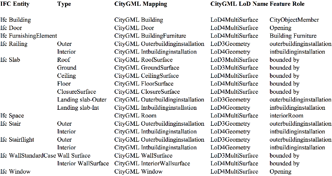

# Attribuut BIM naar GEO

## BIM Classificatie standaarden 
NL-SFB
NLCS
ETIM
NEN2767-4

## Geo Classificatie standaarden
IMBOR
DOOR

NEN 3610
IMKL
IMBAG
IMBGT

## Mapping van Entiteiten

zie: https://ifc2citygml.github.io/ (2019)
zie: https://www.researchgate.net/figure/The-UML-diagram-of-the-developed-IfcADE-the-added-classes-are-in-beige-with-the_fig5_345918816 (2021)

 (2018) George Floros

Dit snap ik niet helemaal. Waarom wordt hier IFc Slab gebruik voor IfcRoof? 

Beter is het overzicht van Sjors Donkers (https://repository.tudelft.nl/record/uuid:31380219-f8e8-4c66-a2dc-548c3680bb8d) (2013)

https://cejcheng.people.ust.hk/bimgis/

## Mapping van Attributen
Attributen en properties van gebouw in IFC:

  <!-- Eerste tabel -->
 
<table>
    <th> Attribuut </th>
    <th>  Beschrijving</th>
<tr>
    <td> GlobalId	
    <td> IfcGloballyUniqueId
<tr>
    <td> OwnerHistory	
    <td> IfcOwnerHistory
<tr>
    <td> Name	
    <td> IfcLabel
<tr>
    <td> Description	
    <td> IfcText
<tr>
    <td> ObjectType	
    <td> IfcLabel
<tr>
    <td> ObjectPlacement
    <td> IfcObjectPlacement
<tr>
    <td> Representation
    <td> IfcProductRepresentation
<tr>
    <td> LongName
    <td> IfcLabel
<tr>
    <td> CompositionType
    <td> IfcElementCompositionEnum
<tr>
    <td> ElevationOfRefHeight
    <td> IfcLengthMeasure
<tr>
    <td> ElevationOfTerrain
    <td> IfcLengthMeasure
<tr>
    <td> BuildingAddress	
    <td> IfcPostalAddres
<tr>
</table>

<!-- Tweede tabel -->
<table border="1" cellpadding="5">
    <th> Properties</th>
    <th>  Beschrijving</th>
<tr>
    <td> Reference	
    <td> IfcGloballyUniqueId
<tr>
    <td> BuildingID	
    <td> A unique identifier assigned to a building.
<tr>
    <td> IsPermanentID	
    <td> Indicates whether identity is permanent
<tr>
    <td> ConstructionMethod	
    <td> The type of construction action
<tr>
    <td> FireProtectionClass
    <td> Main fire protection class for the building
<tr>
    <td> SprinklerProtection
    <td> Indication whether this object is sprinkler protected (TRUE) or not (FALSE).
<tr>
    <td> SprinklerProtectionAutomatic
    <td> Indication whether this object has an automatic sprinkler protection (TRUE) or not (FALSE). It should only be given, if the property "SprinklerProtection" is set to TRUE.
<tr>
    <td> OccupancyType
    <td> Occupancy type for this object. It is defined according to the presiding national building code.
<tr>
    <td> NetPlannedArea
    <td> Total planned net area of the object.
<tr>
    <td> NumberOfStoreys
    <td> The number of storeys within a building.
<tr>
    <td> YearOfConstruction
    <td> Year of construction of this building.
<tr>
    <td> YearOfLastRefurbishment
    <td> Year of last major refurbishment.
<tr>
    <td> IsLandmarked
    <td> This building is listed as a historic building
<tr>
    <td> ElevationOfRefHeight
    <td> Elevation above sea level of the reference height
<tr>
    <td> ElevationOfTerrain
    <td> Elevation above the minimal terrain level around the foot print of the building
</table>

<figure id="IMBAG" style="display: block; text-align: center; margin: 0 auto;">
      
      <figcaption>
        <a class="self-link" href="#fig-IMBAG"></bdi></a>
        
        Objecten en attributen uit de Basisregistratie Adressen en Gebouwen   
        <a href="https://www.geobasisregistraties.nl/documenten/2018/03/12/catalogus-2018" target="_blank">Catalogus Basisregistratie Adressen en Gebouwen</a>
        
      </figcaption>
</figure>

<figure id="Attribuut_IMBOR_gebouw" style="display: block; text-align: center; margin: 0 auto;">
      
      <figcaption>
        <a class="self-link" href="#fig-Attribuut_IMBOR_gebouw"></bdi></a>
        
        Attributen van een gebouw volgens de IMBOR standaard   
        <a href="https://www.geobasisregistraties.nl/documenten/2018/03/12/catalogus-2018" target="_blank">IMBOR 2025</a>
        
      </figcaption>
</figure>

## Status van objecten van BIM naar GEO

<mark>Wouter?</mark>