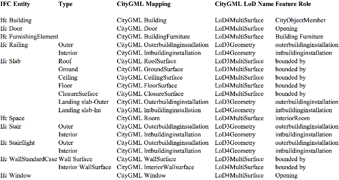
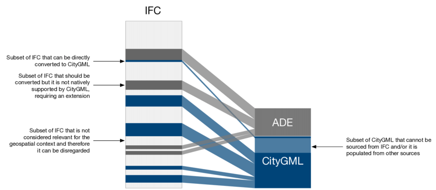
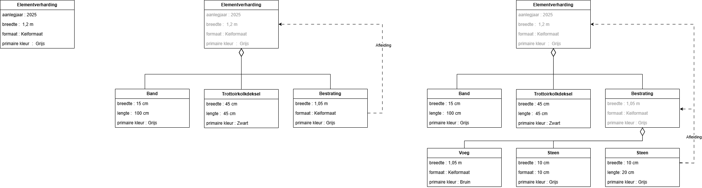
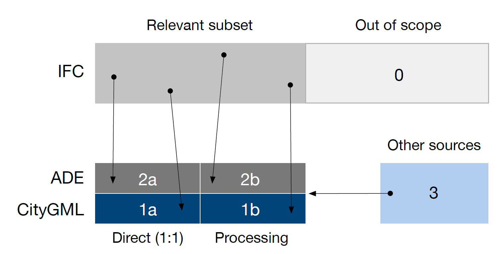
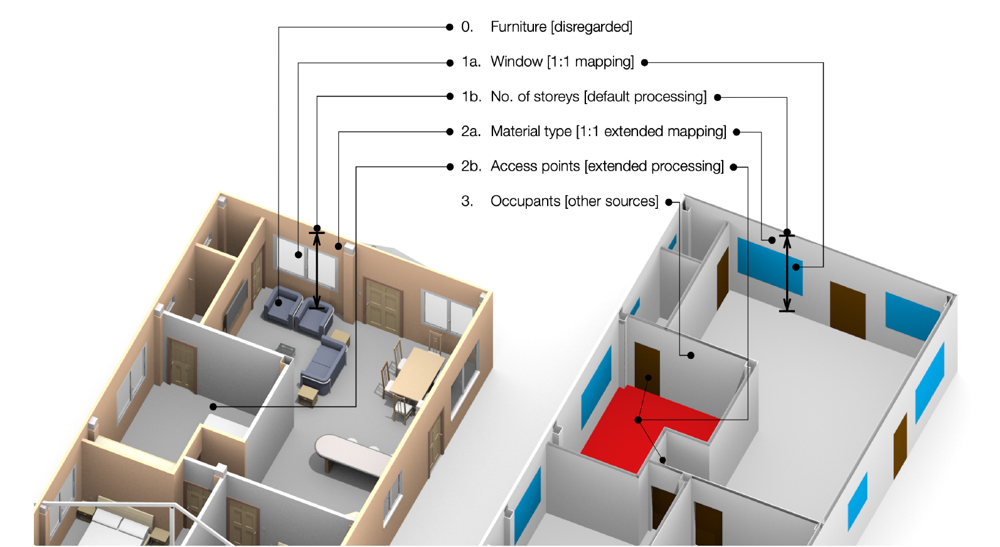
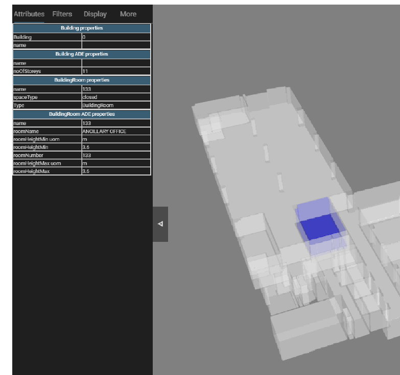

# Entiteit en Attribuut BIM naar GEO

Voor het transformeren van BIM- naar GEO-informatie is het mappen van entiteiten en attributen van belang. Waar geometrie vooral de vorm en locatie van een ding vastlegt, beschrijft de entiteit wat het ding is en bevatten attributen gegevens over eigenschappen zoals materiaal, functie, voorkomen, afmeting of classificatie. Bij de transformatie van BIM naar Geo moeten naast geometrie ook deze entiteiten en attributen correct worden vertaald tussen standaarden. Omdat BIM- en GEO-standaarden verschillen in datastructuur, niveaus van detail en semantische definitie is dit een uitdaging. 

## Entiteit mapping 
Er zijn verschillende entiteit-mappingen ontwikkeld ter ontdersteuning van de conversie tussen BIM en Geo. Een vroeg voorbeeld is de Master Thesis [Automatic generation of CityGML LoD3 building models from IFC models](https://repository.tudelft.nl/record/uuid:31380219-f8e8-4c66-a2dc-548c3680bb8d) van Sjors Donkers (TU Delft, 2013). Daarnaast heeft de Universiteit Singapore een [ifc2citygml](https://ifc2citygml.github.io/) mapping (2019) gemaakt. Ook de technische universiteit Munich voorziet ook in een [mapping en converter](https://github.com/tum-gis/ifc-to-citygml3) van ifc naar Citygml 3. 
De Universiteit van Hong Kong publiceert ifc naar cityGML mappingen in een [bimgis](https://cejcheng.people.ust.hk/bimgis/) omgeving, en de technische universiteit Athene heeft onderstaande mapping uitgewerkt.

 [(2018) George Floros](https://www.researchgate.net/figure/Semantic-mapping-from-IFC-to-CityGML-LoD-4_fig3_327604195)

De verschillende mappingen adresseren enkele of andere LOD's en/of attribuutmappingen en daarmee verschillende aspecten van een BIM naar GEO conversie. De verschillende benaderingen vullen elkaar aan en laten zien dat er geen algemeen geaccepteerde, uniforme mapping bestaat die alle aspecten van een BIM-naar-GEO-conversie afdekt.

Het is niet mogelijk om elke entiteit in IFC naar het basis CityGML-model te mappen. Men zal een keuze moeten maken in welke entiteiten hierbij van belang zijn. Het is mogelijk om één uitbreiding of meerdere uitbreidingen op CityGML te maken om IFC-entiteiten een plek te bieden. Dit is beschreven bij Biljecki in [Extending CityGML for IFC-sourced 3D city models](https://doi.org/10.1016/j.autcon.2020.103440)

Een voorbeeld van een ADE voor IFC-entiteiten in CityGML is weergegeven in [bijlage 2](#-Entiteit-en-Attribuutmapping-tussen-BIM-en-GEO)

Er zijn naast verschillende Level Of Details ook verschillende decompositie-niveaus die men vanuit één gedetailleerd BIM-model kan genereren. Zie [bijlage 1](#Entiteit-en-Attribuutmapping-tussen-BIM-en-GEO)

Zoals in de [BIM basis ILS - hoofdstuk classificatie](https://www.digigo.nu/ilsen-en-richtlijnen/bim-basis-ils/3-6-classificatiesystematiek/)aangegeven dient men naast het juist gebruik maken van entiteiten ook gebruik te maken van classificatie in BIM. Ook dit kan men gebruiken om te mappen. Er zijn verschillend BIM Classificatie standaarden als: NL-SFB, NLCS, ETIM, NEN2767-4, IMBOR of soms domein-specifieke standaarden als SATO van Rijkswaterstaat voor Tunnels. 

<aside class="note" title="Entiteit-mapping op basis van Entiteit of op basis van Clasificatie">
  
<strong>AANBEVELING:</strong> Maak afspraken over de manier van mappen. Of men op basis van entiteit of classificatie mapt. En wat leidend is wanneer classificatie en entiteitgebruik elkaar tegenspreken. 

</aside>

## Mapping van Attributen
Entiteitmapping beschrijft hoe objecttypen uit een BIM-model worden gekoppeld aan objecttypen in een GEO-model, terwijl attribuutmapping beschrijft hoe de eigenschappen van deze objecten worden vertaald en overgenomen tussen beide modellen.

Hier zijn verschillende opties. 

- 1-op-1 mapping 
- Processing: 
  - Many-to-one mapping / aggregatie
  - One-to-many mapping
  - Afgeleide of berekende attributen
  - Transformaties tussen hiërarchische niveaus
- Externe bronnen

### 1-op-1 mapping
Sommige attributen kan men direct, 1-op-1, mappen. Zo komt het attribuut "name" van een "IfcBuilding" eovereen met het attribuut "naam" van een "IMBOR:Gebouw". Beide attributen hebben dezelfde betekenis en kunnen daarom zonder aanvullende transformatie aan elkaar worden gekoppeld. De 1-op-1 mappingen vormen vaak een zeer beperkt deel van een totale attribuuttransformatie. Door verschillen in doel, structuur en detailniveau tussen BIM- en GEO-informatiemodellen moeten veel attributen worden afgeleid, geaggregeerd of via aanvullende transformatieregels worden bepaald.

### Many-to-one mapping
Een model kent bijvoorbeeld het attribuut: "Lengte", "Breedte", "hoogte". Een ontvangend model kent bijvoorbeeld "afmetingen" (l,b,h)	IMBOR.
Bijvoorbeeld "straat", "huisnummer", "postcode", Bij een ander model een attribuut "adres". 

### One-to-many mapping
Objecttype = fietspad in BIM. In GEO is dit CityGML functie = fietspad en type verharding = asfalt. 
Name = "Bank type B12 groen" in IMBOR: objecttype: Bank, typeaanduiding, kleur, groen 
NLCS-naam is ook een goede hiervoor. 

### Afgeleide of berekende attributen
meerder buildingstoreys + geometrie wordt gebouwhoogte in BIM 
De inhoud van de netto ruimten en de products wordt het Bruto Inhoud of er kan een BVO van berekend worden. 

### Transformaties tussen hiërarchische niveaus
Zowel in GEO- als BIM-informatiemodellen komen verschillende decompositieniveaus voor. Attributen van objecten op een hoger decompositieniveau kunnen worden afgeleid of geaggregeerd van objecten op een lager decompositieniveau. Daarbij is vaak sprake van een specifieke relatie tussen een attribuut van een samengesteld object en een attribuut van één of meerdere onderliggende objecttypen waaruit dat object is opgebouwd.

Zo kan een objecttype "elementverharding" op een lager decompositieniveau bestaan uit een band, trottoirkolkdeksels en bestrating. Het attribuut "formaat" van een hoger decompositieniveau betreft het formaat van de stenen of tegels in het bestratingsvlak. Het betreft niet het formaat van een band of een trottoirkolk waaruit het object elementverharding ook bestaat. Een decompositieniveau lager kan het keiformaat van de bestrating afgeleid worden van de hele stenen waaruit het bestratingsvlak bestaat. 

Expliciete afleidings- of aggregatieregels zijn nodig, waarin wordt vastgelegd van welk onderliggend objecttype en attribuut de waarde op een hoger decompositieniveau wordt afgeleid.

<figure id="Afleiding_van_attribuut">
      
    <figcaption><a class="self-link" href="#fig-Afleiding_van_attribuut"></bdi></a>Afleiding van attribuut</figcaption>
</figure>

### Externe bronnen
Bij een conversie van IFC naar CityGML is het niet altijd mogelijk om alle benodigde informatie uitsluitend uit het IFC-model af te leiden. Externe bronnen kunnen onder meer worden ingezet voor het aanvullen van ontbrekende attributen, het bepalen van classificaties, het afleiden van functies of het verrijken van objecten met contextinformatie. Voorbeelden hiervan zijn basisregistraties, topografische datasets, adressen- en gebouwenregistraties, hoogtebestanden etc.

Een totale BIM naar GEO entiteit en attribuutmapping zal een combinatie van de hierboven beschreven opties zijn. Zoals beschreven in [Extending CityGML for IFC-sourced 3D city models](https://doi.org/10.1016/j.autcon.2020.103440). 

<figure id="Routes_attribuut_mapping_1">
      
    <figcaption><a class="self-link" href="#fig-Routes_attribuut_mapping_1"></bdi></a>Routes van attribuut mapping</figcaption>
</figure>

In dit figuur betekent "0" de informatie die niet van BIM naar GEO hoeft te gaan. Het getal "1" staat voor CityGML en "2" voor een aanvulling op CityGML in de vorm van een ADE. Het getal "3" staat voor de externe bronnen die knnen ondersteunen in het genereren van CityGML. De letters "a" staan voor de directe 1 op 1 mappingen en "b" voor de procesmappingen. 

Onderstaand voorbeeld laat zien hoe al deze routes binnen één conversie van BIM naar GEO gebruikt worden. In onderstaand voorbeeld worden *meubels* buiten beschouwing gelaten voor conversie ("0"). Voor de entiteit *raam* bestaat een 1 op 1 mapping naar CityGML ("1a"). Het *aantal verdiepingen* zal berekend kunnen worden om in CityGML te vertalen ("1b"). Het materiaaltype van een object kan een 1 op 1 mapping naar een CityGML ADE zijn ("2a"), het aantal toegangspunten van een kamer een procesmapping naar een ADE ("2b"). Tenslotte is het aantal bewoners alleen vanuit externe bronnen ("3") toe te voegen.

<figure id="Routes_attribuut_mapping_2">
      
    <figcaption><a class="self-link" href="#fig-Routes_attribuut_mapping_2"></bdi></a>Routes van attribuut mapping</figcaption>
</figure>

Een voorbeeldresultaat van bovenstaande attribuutmapping is hieronder weergegeven. Een aantal attributen op gebouwniveau zijn basis CityGML. Een aantal aanvullende ADE properties voorzien meer informatie over dit gebouw na mapping.  
<figure id="Routes_attribuut_mapping_3">
      
    <figcaption><a class="self-link" href="#fig-Routes_attribuut_mapping_3"></bdi></a>Routes van attribuut mapping</figcaption>
</figure>

