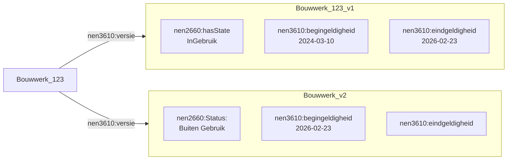

# Levenscyclus van BIM naar GEO

## Status van objecten van BIM naar GEO
Geo- en BIM-objecten kunnen hetzelfde fysieke bouwwerk beschrijven, maar vanuit verschillende perspectieven en detailniveaus. Gedurende de gehele levenscyclus van een bouwwerk, van ontwerp en realisatie tot beheer, renovatie en sloop, hebben deze objecten met elkaar een relatie. Wijzigingen in BIM-objecten, zoals aanpassingen aan afmetingen, functies of constructieve elementen, hebben gevolgen voor de geo-objecten. Een consistente koppeling tussen geo- en BIM-data is daarom essentieel om informatie gedurende de levenscyclus van een object actueel en betrouwbaar te houden.

De Gebouwde Omgeving Referentie Architectuur (GEBORA) bestaat uit verschillende onderdelen, zie [GEBORA-onderdelen](https://www.digigo.nu/gebora-onderdelen/). Een van deze onderdelen is de [GEBORA Bouwwerk Levenscyclus](https://www.digigo.nu/gebora-bouwwerk-levenscyclus/). 

<figure id="Gebora_levenscyclus">
      
    <figcaption><a class="self-link" href="#fig-Gebora_levenscyclust"></bdi></a><span class="fig-title">Gebora levenscyclus</span></figcaption>
</figure>

Wanneer een functionele behoefte bestaat, bijvoorbeeld men wil wonen, dan wordt er een technische uitwerking gemaakt van een object die voorziet in de functionele behoefte. Bijvoorbeeld er wordt een woning ontworpen. De technische entiteit wordt vaak in BIM uitgewerkt. Na verschillende ontwerp-iteraties wordt de entiteit gerealiseerd en voorziet het, bij goed ontwerp, in de functionele behoefte. 

Een entiteit kan een maatregel en een status van deze maatregel meekrijgen. Op basis van deze maatregel en status kan de BIM naar GEO conversie tot verschillende acties leiden. 

In BIM definieert men een maatregel welke men uit kan voeren op een entiteit. Dit kan volgens de GWSW maatregel ontologie een van de volgende maatregelen zijn:

- Aanleggen
- Buiten gebruik stellen
- Conserveren
- Onderhouden
- Onderzoeken
- Renoveren
- Repareren
- Vervangen
- Verwijderen

Een maatregel heeft daarnaast een status. Deze status kan zijn: 
- Gepland
- In Uitvoering
- In Voorbereiding
- Uitgevoerd 
- Vervallen 

Zowel de maatregel als de status is nodig om te weten op welke manier men een entiteit van BIM naar GEO moet brengen. 

Voor een **bouwwerk** waaraan de *maatregel* **aanleggen** is gekoppeld en de *status* hiervan **Uitgevoerd** is, dient men een GEO-entiteit te **maken**. 

Voor een **bouwwerk** waaraan de *maatregel* **Buiten gebruik stellen, Conserveren, Onderhouden, Onderzoeken, Renoveren, Repareren, of Vervangen** is gekopppeld, en de *status* hiervan **Uitgevoerd** is, dient men een GEO-entiteit te **wijzigen**

Voor een **bouwwerk** waaraan de *maatregel* **verwijderen** is gekoppeld, en de *status* hiervan **Uitgevoerd** is, dient men een GEO-entiteit te **Verwijderen** (of in historie te plaatsen)

Wanneer de *status* **vervallen** is vindt er geen BIM naar GEO conversie plaats. Bij de *status* **Gepland**, **In Uitvoering** en **In Voorbereiding** hangt de BIM naar GEO conversie af van het feit of de GEO-omgeving plangegevens wil ontvangen. 

Bij de integratie van BIM naar GEO ontstaat een uitdaging rondom de levenscyclus van objecten. Een geplande geometrie uit een BIM-model wordt toegevoegd aan de bestaande GEO-registratie, maar zonder correcte toepassing van tijds- en levenscyclusattributen blijft de bestaande geometrie zichtbaar. Hierdoor worden de huidige en toekomstige situatie door elkaar weergegeven.

<figure id="Gebiedsontwikkeling_BIM_naar_GEO">
      
    <figcaption><a class="self-link" href="#fig-Gebiedsontwikkeling_BIM_naar_GEOt"></bdi></a><span class="fig-title">Gebiedsontwikkeling BIM naar GEO</span></figcaption>
</figure>

## Nieuwe versies
Wanneer men BIM naar GEO brengt kan bestaande GEO-data wijzigigen. Er kunnen nieuwe objecten ontstaan, er kunnen objecten verdwijnen of er kunnen nieuwe versies van bestaande GEO-objecten ontstaan.


<figure id="Mermaidvoorbeeld">


<figcaption>Voobeeld van een bouwwerk met meerdere versies</figcaption>
</figure>


<figure id="Mermaidvoorbeeld">

```mermaid
flowchart LR
    A[Bouwwerk_123] -->|nen3610:versie| B

    subgraph B["Bouwwerk_123_v1"]
        B1["nen2660:hasState<br/>InGebruik"]
        B2["nen3610:begingeldigheid<br/>2024-03-10"] 
        B3["nen3610:eindgeldigheid<br/> -"]
        B4["rdf:type<br/> nen2660:RealizedEntity]
    end

    A -->|nen3610:versie| C

    subgraph C["Bouwwerk_v2"]
        C1[nen2660:Status:<br/> Buiten Gebruik]
        C2["nen3610:begingeldigheid<br/>2026-02-23"] 
        C3["nen3610:eindgeldigheid<br/> "]
        C4["rdf:type<br/> nen2660:PlannedEntity]
    end
```
<figcaption>Voorbeeld van een bouwwerk met meerdere versies</figcaption>
</figure>