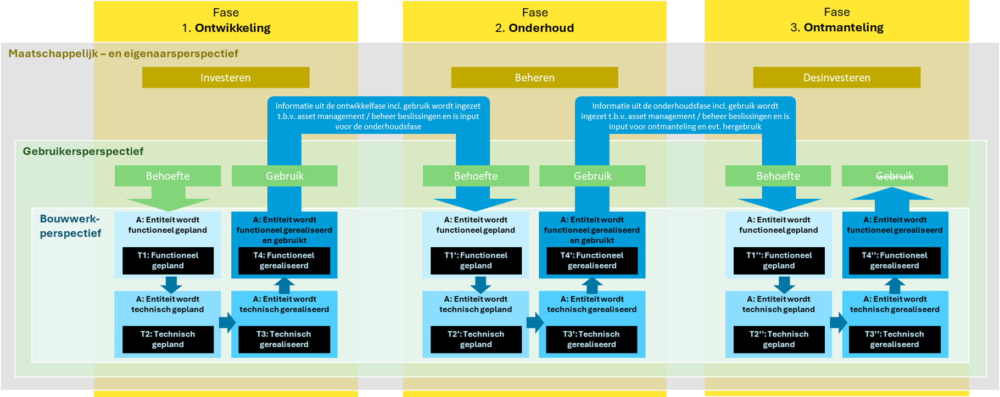
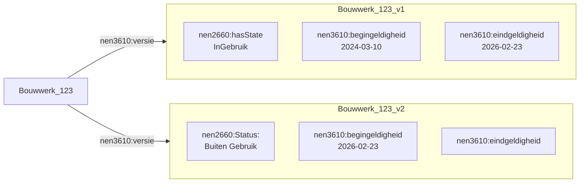
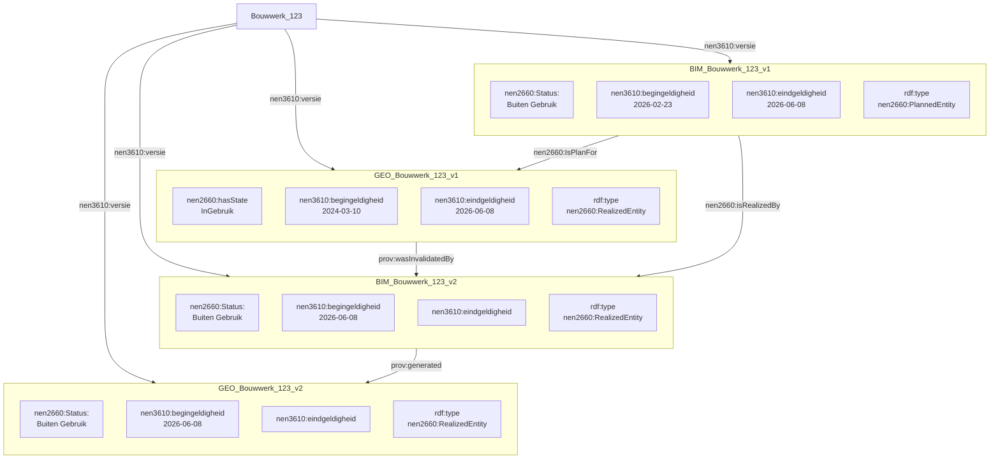

# Levenscyclus van BIM naar GEO

## Status van objecten van BIM naar GEO
Geo- en BIM-objecten kunnen hetzelfde fysieke bouwwerk beschrijven, maar vanuit verschillende perspectieven en detailniveaus. Gedurende de gehele levenscyclus van een bouwwerk, van ontwerp en realisatie tot beheer, renovatie en sloop, hebben deze objecten met elkaar een relatie. Wijzigingen in BIM-objecten, zoals aanpassingen aan afmetingen, functies of constructieve elementen, hebben gevolgen voor de geo-objecten. Een consistente koppeling tussen geo- en BIM-data is daarom essentieel om informatie gedurende de levenscyclus van een object actueel en betrouwbaar te houden.

De Gebouwde Omgeving Referentie Architectuur (GEBORA) bestaat uit verschillende onderdelen, zie [GEBORA-onderdelen](https://www.digigo.nu/gebora-onderdelen/). Een van deze onderdelen is de [GEBORA Bouwwerk Levenscyclus](https://www.digigo.nu/gebora-bouwwerk-levenscyclus/). 

<figure id="Gebora_levenscyclus">
      
    <figcaption><a class="self-link" href="#fig-Gebora_levenscyclust"></bdi></a>Gebora levenscyclus</figcaption>
</figure>

Wanneer een functionele behoefte bestaat, bijvoorbeeld men wil wonen, dan wordt er een technische uitwerking gemaakt van een object die voorziet in de functionele behoefte. Bijvoorbeeld er wordt een woning ontworpen. De technische entiteit wordt vaak in BIM uitgewerkt. Na verschillende ontwerp-iteraties wordt de entiteit gerealiseerd en voorziet het, bij goed ontwerp, in de functionele behoefte. 

Een entiteit kan een maatregel en een status van deze maatregel meekrijgen. Op basis van deze maatregel en status kan de BIM naar GEO conversie tot verschillende acties leiden. 

In BIM definieert men een maatregel welke men uit kan voeren op een entiteit. Dit kan volgens de GWSW maatregel ontologie een van de volgende maatregelen zijn:

- Aanleggen
- Buiten gebruik stellen
- Conserveren
- Onderhouden
- Onderzoeken
- Renoveren
- Repareren
- Vervangen
- Verwijderen

Een maatregel heeft daarnaast een status. Deze status kan zijn: 
- Gepland
- In Uitvoering
- In Voorbereiding
- Uitgevoerd 
- Vervallen 

Zowel de maatregel als de status is nodig om te weten op welke manier men een entiteit van BIM naar GEO moet brengen. 

Voor een **bouwwerk** waaraan de *maatregel* **aanleggen** is gekoppeld en de *status* hiervan **Uitgevoerd** is, dient men een GEO-entiteit te **maken**. 

Voor een **bouwwerk** waaraan de *maatregel* **Buiten gebruik stellen, Conserveren, Onderhouden, Onderzoeken, Renoveren, Repareren, of Vervangen** is gekopppeld, en de *status* hiervan **Uitgevoerd** is, dient men een GEO-entiteit te **wijzigen**

Voor een **bouwwerk** waaraan de *maatregel* **verwijderen** is gekoppeld, en de *status* hiervan **Uitgevoerd** is, dient men een GEO-entiteit te **Verwijderen** (of in historie te plaatsen)

Wanneer de *status* **vervallen** is vindt er geen BIM naar GEO conversie plaats. Bij de *status* **Gepland**, **In Uitvoering** en **In Voorbereiding** hangt de BIM naar GEO conversie af van het feit of de GEO-omgeving plangegevens wil ontvangen. 

Bij de integratie van BIM naar GEO ontstaat een uitdaging rondom de levenscyclus van objecten. Een geplande geometrie uit een BIM-model wordt gecombineerd met de bestaande GEO-registratie, maar zonder correcte toepassing van tijds- en levenscyclusattributen blijft de geometrie van bestaande bouwwerken die in ontwerp weg zouden gaan zichtbaar. Hierdoor worden de huidige en toekomstige situatie overlappend weergegeven.

<figure id="Gebiedsontwikkeling_BIM_naar_GEO">
      
    <figcaption><a class="self-link" href="#fig-Gebiedsontwikkeling_BIM_naar_GEOt"></bdi></a>Gebiedsontwikkeling BIM naar GEO</figcaption>
</figure>

Bovenstaand voorbeeld is gemaakt met een toepassing die gebruik maakt van 3D Tiles volgens de [[3DTILES]] Standaard. Deze standaard kent de functie "style.show". Hierin kan men met een boolean (true/false) per object (feature) aangeven of deze wordt weergegeven. Het brengen van BIM naar GEO en het correct weergeven van temporele (ontwerp)situaties is geen opgave voor een standaard, maar voor de applicaties en toepassingen.   

## Levenscyclus versies
Wanneer men BIM naar GEO brengt kan bestaande GEO-data wijzigigen. Er kunnen nieuwe objecten ontstaan, er kunnen objecten verdwijnen of er kunnen nieuwe versies van bestaande GEO-objecten ontstaan. Ook is het in theorie mogelijk om een BIM-versie van een GEO-object te modelleren. 

Onderstaand voorbeeld toont een manier waarop meerdere versies van een bouwwerk gemodelleerd kunnen worden. Een "nen3610:begingeldigheid" geeft aan wanneer een object is ontstaan. Een "nen3610:eindgeldigheid" beschrijft wanneer een object niet meer geldig is. Wanneer een object geen waarde heeft voor "nen3610:eindgeldigheid" bestaat het object. Wanneer een bouwwerk verwijderd wordt ontstaat een nieuwe versie die een "Status", "Buiten Gebruik" heeft met een waarde "nen3610:begingeldigheid" die overeenkomt met de "nen3610:eindgeldigheid" van de versie die niet meer in gebruik is.    

<figure id="Bouwwerk-versies-1">

<figcaption>Voorbeeld- van een bouwwerk dat in een nieuwe versie buiten gebruik is.</figcaption>
</figure>

Onderstaand voorbeeld toont GEO- en BIM-versies van een bouwwerk. Een Bouwwerk in een BIM-omgeving kan een plan zijn voor een bestaand Bouwwerk die bestaat in een (GEO-)registratie. Het plan kan dan een versie zijn van het bouwwerk. Wanneer het plan (BIM) daadwerkelijk gerealiseerd is, is de versie van het plan "einde geldigheid". Er ontstaat dan een versie die een gerealiseerd plan is met een "begin geldigheid". Dit gerealiseerde plan "invalideert" een versie in de GEO-omgeving en genereert een versie in de GEO-omgeving. 

<figure id="Bouwwerk-versies-2">

<figcaption>Voorbeeld van een bouwwerk met GEO- en BIM-versies. Waarbij een gerealiseerde BIM-versie een GEO-versie genereert.</figcaption>
</figure>

