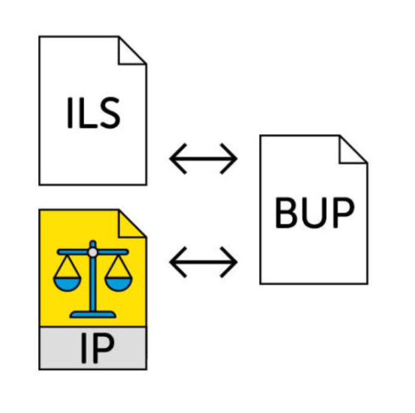
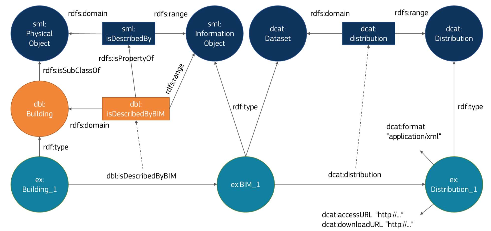
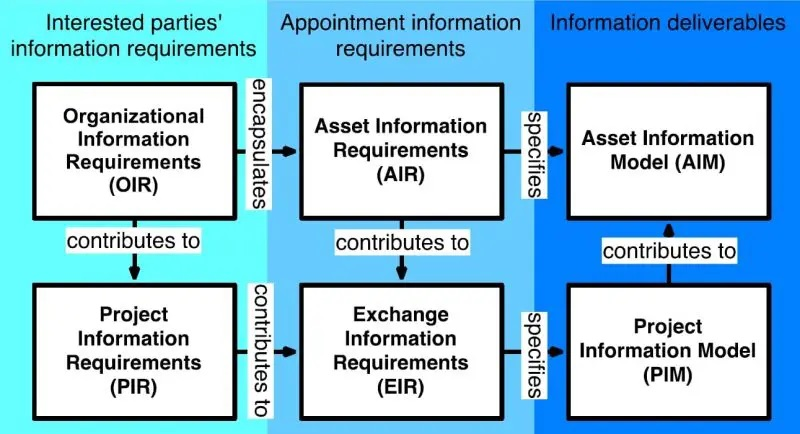

# Eisen aan model en mapping 

## Eisen aan het BIM-model 

Een succesvolle transformatie van een BIM model naar een GIS bestandsformaat begint bij het maken van de juiste afspraken vóór de start van het modelleerwerk. Zonder duidelijke kaders bestaat de kans dat een BIM-model te complex of kwalitatief ontoereikend is. Dit kan de mogelijkheden voor gebruik in een geografische informatiesystemen en conversie naar GEO reduceren.

Duidelijke procesafspraken en kwaliteitscontroles vergroten de betrouwbaarheid, consistentie en bruikbaarheid van de data. Hierbij kan men gebruikmaken van de [ISO 19650](https://www.iso.org/sectors/building-construction/building-information-modelling) reeks, de internationale norm voor informatiemanagement in de gebouwde omgeving. Deze norm biedt de processen om vast te leggen wie welke informatie moet leveren, wanneer en hoe.

## Landelijke BIM-afspraken
In Nederland bestaan landelijke BIM-afspraken. Deze afspraken zorgen voor een eenduidige werkwijze en bevorderen interoperabiliteit, datakwaliteit en de mogelijkheid tot samenwerking. De landelijke afspraken zijn opgebouwd uit drie samenhangende onderdelen conform de ISO 19650; de Informatie Levering Specificatie (ILS), het Informatie Protocol (IP) en het BIM Uitvoerings Plan (BUP). Samen beschrijven zij de informatie-eisen, de afspraken over informatiebeheer,verantwoordelijkheden en eigendom en de inrichting van de BIM-samenwerking. 


<figure id="ILS-IP-BUP-digigo" style="display: block; text-align: center; margin: 0 auto;">
      
      <figcaption>
        <a class="self-link" href="#fig-ILS-IP-BUP-digigo"></bdi></a>
        <span class="fig-title">
        Informatie Levering Specificatie (ILS), Informatie Protocol (IP) en Bim Uitvoerings Plan (BUP) als contractuele afspraak over data-creatie, -overdracht en -gebruik. <br>
        Bron: <a href="https://www.digigo.nu/ilsen-en-richtlijnen/informatieprotocol/">DigiGO</a>.
        </span>
      </figcaption>
</figure>

In deze praktijkrichtlijn wordt voornamelijk de InformatieLeveringsSpecificatie (ILS) toegelicht, omdat deze de belangrijkste randvoorwaarden bevat voor de technische conversie van BIM naar GEO. 

DigiGO beheert een aantal templates en sectorbrede standaarden zoals; de BIM basis ILS (met een focus op de bouw),de BIM basis Infra (met een focus op infrastructuur), de ILS Ontwerp&Engineering, het nationaal model Informatie Protocol, het nationaal template BIM UitvoeringsPlan. Deze richtlijnen en templates bieden een set afspraken en handvatten voor het gestructureerd en eenduidig uitwisselen van digitale informatie. De landelijke (sector) afspraken kunen binnen organisaties en projecten verder uitgewerkt worden en deze afpsraken kan men in contracten vastleggen.

<figure id="BIM-digigo" style="display: block; text-align: center; margin: 0 auto;">
      
      <figcaption>
        <a class="self-link" href="#fig-BIMdigigo"></bdi></a>
        <span class="fig-title">
        Samenwerking in BIM op basis van sectorafspraken
        </span>
      </figcaption>
</figure>

 Het hebben van gestandaardiseerd BIM is essentieel voor BIM naar GEO conversie.Hoewel er zowel aan de BIM-zijde als aan de GEO-zijde afspraken beschikbaar zijn, ontbreekt een verbindende laag tussen beide werelden. Een BIM-model dat volgens de BIM Basis ILS is opgebouwd en een GEO-dataset volgens IMBGT kunnen daardoor (nog) niet zonder aanvullende afspraken één-op-één op elkaar worden aangesloten. Een toekomstig toepassingsprofiel kan deze koppeling ondersteunen door afspraken te maken over objectidentificatie, geometrie, semantiek en informatie-uitwisseling.

**ILS-onderdelen waarover men afspraken dient te maken voor BIM naar Geo**
- Bestandsnaamconventies:  
    Bestandsnaamconventies beschrijven afspraken voor het eenduidig identificeren en beheren van informatiebestanden. De bestandsnaam bevat hierbij alleen noodzakelijke metadata voor beheer en uitwisseling en is niet bedoeld om inhoudelijke informatie over objecten of eigenschappen vast te leggen. Deze informatie dient onderdeel te zijn van het model of de dataset zelf. 
- Eenheden:  
    Het consistent gebruik van eenheden voorkomt schaalfouten bij BIM naar GEO conversies. Het juist interpreteren van eenheden kan men bereiken door vaste afspraken te maken en na te leven over het gebruik van eenheden en/of de eenheden in het model of metadata te duiden. 
- Georeferentie:  
    Er wordt per project een methode van georeferentie gekozen. Dit is cruciaal om BIM modellen correct te koppelen aan GIS data. Meestal gaat het om het RD-stelsel (EPSG:28992) en NAP hoogte (EPSG:EPSG:5709). Dit wordt projectafhankelijk vastgelegd. Zie [Georefereren GeoBIM](https://nl-digigo.github.io/geobim-georefereren/).
- Semantische typering en classificatie:  
    Voor een betrouwbare BIM naar GEO-conversie is het noodzakelijk dat objecten zijn toegewezen aan een passende entiteit  uit een nationaal of internationaal informatiemodel, zoals IFC. Door middel van classificatie kan een object verder worden gespecificeerd en eenduidig worden gecategoriseerd volgens een gestandaardiseerde systematiek. In Nederland kan men hiervoor bijvoorbeeld [NL-SfB](https://ketenstandaard.nl/nlbe-sfb-facts/), [NLCS](https://www.digigo.nu/standaarden/nlcs/) of [ETIM](https://www.etim-international.com/) voor gebruiken.  
- Attributen en properties:  
  Objecten krijgen afgesproken vaste attributen en properties, zoals:
    - Status Object (In ontwerp, In aanleg, In gebruik, Buiten gebruik) 
    - Maatregel (Verwijderen, Aanleggen, Repareren, Onderhouden, Vervangen) 
    - Materiaal ([IfcRelAssociatesMaterial](https://ifc43-docs.standards.buildingsmart.org/IFC/RELEASE/IFC4x3/HTML/lexical/IfcRelAssociatesMaterial.htm) [IfcMaterial](https://ifc43-docs.standards.buildingsmart.org/IFC/RELEASE/IFC4x3/HTML/lexical/IfcMaterial.htm) met [N.A.A.KT](https://www.digigo.nu/ilsen-en-richtlijnen/tools-voor-informatiemanagement/naa-k-t/) classificatie)
    - [ITSO](https://www.digigo.nu/ilsen-en-richtlijnen/bim-basis-infra/3-9-in-te-storten-onderdelen-itso/)-indicatie (in te storten onderdelen)
- Standaard metadata:
    - Een IFC-model bevat metadata over het eigen model, zoals opsteller, gebruikt schema etc. 
    - Metadata naast IFC, in DCAT/GeoDCAT formaat, kan publicatie, catalogisering, vindbaarheid, interpreteerbaarheid en hergebruik bevorderen.   
    Dit sluit aan op de aanbeveling in [Technical guidlines for digital building logbooks](https://www.ecorys.com/app/uploads/2019/02/DBL-Technical-Guidelines-for-DBLs.pdf) van Ecorys, TNO, Arcadis en Contecht. 

    <figure id="Physical_and_information_objects" style="display: block; text-align: center; margin: 0 auto;">
          
          <figcaption>
            <a class="self-link" href="#fig-Physical_and_information_objects"></bdi></a>
            <span class="fig-title">
            Semantisch model fysieke objecten en informatie objecten
            </span>
          </figcaption>
    </figure>
-	Voorkomen van doublures en doorsnijdingen: 
    Er is sprake van een doublure als hetzelfde fysieke object op dezelfde locatie én binnen een  aspectmodel, coördinatiemodel of project vaker voorkomt. Er is sprake van een doorsnijding als twee objecten deels door elkaar heen steken.elangrijk voor clashcontrole en correcte weergave in gecombineerde BIM GIS omgevingen.

**Wat betekent dit praktisch voor GeoBIM gebruik?**
Door deze afspraken wordt een BIM-model geschikt gemaakt voor koppeling en hergebruik binnen een GEO-omgeving. Objecten kunnen automatisch worden herkend en vertaald naar geo-objecten doordat de geometrie, semantiek, classificatie en metadata eenduidig zijn vastgelegd. Hierdoor neemt de noodzaak voor handmatige bewerkingen af en wordt het mogelijk om BIM-informatie betrouwbaarder te gebruiken voor beheer, analyse en besluitvorming.

Concreet betekent dit:
- Georeferentie zorgt ervoor dat BIM en GEO ruimtelijk op elkaar aansluiten  
    Een object uit het BIM-model (bijvoorbeeld een brug of leiding) komt op de juiste positie in een GIS-kaart terecht.
- Classificatie en IFC-typering zorgen ervoor dat objecten herkenbaar zijn  
    Een IfcWall, IfcPipeSegment of IfcBridgePart kan worden gekoppeld aan het juiste GEO-objecttype (CityGML:WallSurface, CityGML:Pipe (Utility Network ADE), CityGML:Bridgepart).
- Attributen en properties zorgen ervoor dat relevante informatie behouden blijft
    Bijvoorbeeld materiaal, status, levensfase of beheerinformatie kan worden meegenomen naar een GEO-dataset.
- Gestandaardiseerde metadata maakt datasets vindbaar en begrijpelijk
    Gebruikers weten wat het model bevat, wie het heeft gemaakt, welke versie het is en waarvoor het geschikt is.
- Voorkomen van doublures en doorsnijdingen voorkomt interpretatieproblemen
    Objecten worden niet dubbel weergegeven of verkeerd gecombineerd in BIM/GIS-omgevingen 
- Clashcontroles worden betrouwbaarder
→   Doordat objecten eenduidig zijn gemodelleerd en correct zijn gegeorefereerd, kunnen geometrische conflicten tussen BIM-objecten of tussen BIM- en GEO-informatie beter worden opgespoord.


De inhoud van eisen aan een BIM- en/of GEO-model komen uit een volgende behoefte. De ISO 19650 gaat uit van een ketenbenadering: informatie wordt niet alleen voor de eigen organisatie gecreëerd, maar juist voor uitwisseling en hergebruik door andere partijen. Dit is essentieel voor GeoBIM, waar gegevens geschikt moeten zijn voor conversies tussen BIM en GIS zonder verlies van informatie.

| Behoefte/Eis | Voorbeeld | 
|--------------|---------- |
| Organizational Information Requirement (OIR) | "Wij willen vastgoed beheren en daarom hebben wij informatie nodig"  |  
| Asset Information Requirements (AIR) | "Voor vastgoedbeheer hebben wij de gegevens nodig van materiaal, onderhoud, levensduur, constructie, gebruik" |
|Asset Information Model (AIM) |"In het asset beheersysteem kennen wij het "Object" "Gebouw" met de attributen "Materiaal, "levensduur", "Constructie" en "Gebruik" en wij kennen de "Activiteit" "Onderhoud" die een koppeling krijgt naar een gebouw."  | 
|Project Information Requirements (PIR) |Voor de renovatie van dit vastgoedproject hebben wij informatie nodig om het ontwerp, de realisatie en de toekomstige overdracht naar beheer mogelijk te maken." |
|Exchange Information Requirements (EIR) |"Deze bestaande assetinformatie en projectinformatie moet door deze betrokken partijen op afgesproken momenten en in afgesproken formats worden geleverd." |
|Project Informatie model (PIM) | "Tijdens het project wordt deze informatie vastgelegd in het Project Information Model. En materiaal, levensduur, constructie wordt naar het asset information model gestuurd" |

  <figure id="ISO-19650-dataproducten-en-relaties" style="display: block; text-align: center; margin: 0 auto;">
          
          <figcaption>
            <a class="self-link" href="#fig-19650-dataproducten-en-relatie"></bdi></a>
            <span class="fig-title">
            ISO 19650 dataproducten en relaties
            </span>
          </figcaption>
    </figure>

## Informatie Leverings Specificatie (ILS)
Een ILS (informatie leveringsspecificatie) legt vast welke informatie, wanneer en door welke partij geproduceerd moet worden. 
In Nederland wordt ILS (InformatieLeveringsSpecificatie) vaak gebruikt als een overkoepelende term, waardoor het soms zowel elementen bevat van wat volgens de [Building Smart Terminologie](https://user.buildingsmart.org/knowledge-base/terminology/) IDM (Information Delivery Manual), IDS (Information Delivery Specification) en soms ook EIR (Exchange Information Requirements) worden genoemd. In een IDM wordt een EIR en IDS opgenomen.  

Een Informatie Levering Specificatie conform het begrip IDS kan in mens- en/of computer-interpreteerbare vorm opgesteld worden. Voor het laatste zijn twee gangbare methoden:
- BuildingSMART heeft de standaard [Information Delivery Specification](https://www.buildingsmart.org/standards/bsi-standards/information-delivery-specification-ids/) (IDS) ontwikkeld. Dit is een XML-bestand dat aangeeft welke data vastgelegd dient te worden en waar de data aan moet voldoen. Tegelijkertijd kan dit bestand gebruikt worden om IFC-bestanden te valideren tegen deze eisen in verschillende applicaties.
- Vanuit Nederlandse en Europese normalisatie zijn respectievelijk de normen [NEN 2660-2](https://www.nen.nl/en/nen-2660-2-2022-nl-291667) en Building information modelling (BIM) - Semantic modelling and linking (SML) [NEN-EN 17632](https://www.nen.nl/nen-en-17632-1-2022-en-304869) ontwikkeld. Hiermee is het mogelijk om, middels de Linked Data-standaard SHACL, restricties vast te leggen en door de computer te laten valideren.

Zo kan de voorwaarde dat elk object een maatregel en status dient te hebben als volgt worden vastgelegd conform IDS of in SHACL. (Zie bijlage E)

Om te voorkomen dat voor iedere ILS opnieuw nagedacht moet worden over objecten en kenmerken, is het sterk aan te raden om een standaard of ontologie te gebruiken als basis voor de ILS. Voorbeelden hiervan zijn de [ILS O&E](https://www.digigo.nu/ilsen-en-richtlijnen/ils-ontwerp-en-engineering/), [IMBOR](https://www.crow.nl/kennisproducten/imbor/) en de [NLCS](https://www.digigo.nu/standaarden/nlcs/). Daarnaast helpt het gebruik van standaarden om de herkenbaarheid van de data te vergroten tussen verschillende disciplines. 

## Eisen aan het BIM-model (ILS) <!-- Voorstel: inhoud van deze paragraaf opdelen in algemene afspraken (hierboven) en ILS (hieronder) -->
-> Afwijkingen Stuk Jasper(voor welke extractie welke eisen). 

Eisen voor shell extractie 
De eisen aan het BIM-model voor een shell extractie zijn beperkt. Het is van belang dat georeferentie in het model aanwezig is. (IFCMapConversion).
Daarnaast dient er minimaal een IFCProduct  aanwezig te zijn die geometrie bezit. <!-- IS IFC_Space ook goed? -->
De extractie-software werkt voor de actieve schema's (2x3, 4 en 4x3)

De ILS/IDS voor deze beknopte eisenset zou kunnen zijn: 

- <mark> Nog in te vullen </mark>

Afhankelijk van het soort extractie gelden meer eisen. 

Eisen voor 1 op 1 mapping: 
De eisen voor een 1 op 1 mapping zijn al iets uitgebreider. Het is van belang dat georeferentie in het model aanwezig is. (IFCMapConversion).
Daarnaast dient er minimaal een IFCProduct aanwezig te zijn die geometrie bezit. <!-- IS IFC_Space ook goed? -->
De extractie-software werkt voor de actieve schema's (2x3, 4 en 4x3).

<mark> Heb je IfcRoof nodig? </mark>

De extractie kan filteren op: IfcBeam, IfcColumn, IfcCovering, IfcCurtainWall, IfcDoor, IfcMember, IfcPlate, IfcRoof, IfcSlab, IfcWall, IfcWallStandardCase, IfcWindow. Wat betekent dit voor een ILS? 

Daarnaast is een remedie voor de bestandgroote te filteren op isExternal property Wat betekent dit voor een ILS? 

Toevoegen -> Welke datasets. BAG 2D 
-> ILS -> IDS for making LOD 1.0 (BAG 2D) geometrie 

-> Voor PAND-geometrie is alles nodig van IfcBuilding? -> Kan groter zijn dan Pand. Hoe dit te doen? 
-> Voor PAND-attribuut is YearOfConstruction nodig (IfcPsetBuildingCommon) ILS? 


LOD2.2 maakt Roofsurface, Groundsurface en Wallsurface. Het is handig als in het IFCModel IfcWall, IfcRoof en IfcSlab zit en

Daarnaast is IFCBuildingStorey handig. 

Bij LOD 3.2 
-> Hier moet raam aanwezig zijn: 

-> Classificatie volgens NL-Sfb 
(als classificatie = Nl-Sfb 31 raam -> dan moet entity = IfcWindow) 

```xml 
<specification>
  <applicability>
    <classification system="NL-SfB" value="31"/>
  </applicability>

  <requirements>
    <entity name="IfcWindow"/>
  </requirements>
</specification>
```


-> IDS for making BAG attributes (BAG 2D) attributes

-> IFC naar CityGML Mapping


-> https://ucm.buildingsmart.org/en/use-cases/3536/en


## Eisen aan het Geomodel 


## Eisen aan de mapping

### Afgesproken mapping
[NLCS-IMGEO-mapping](https://www.geonovum.nl/nieuws/uitwisseling-geometrie-nederlandse-cad-standaard-en-imgeo)


### Allignment ontology
Een alignment ontology kan worden gebruikt om BIM naar GEO mappingen op een gestandaardiseerde en machineleesbare manier vast te leggen. In plaats van alleen een directe koppeling tussen entiteiten en attributen te beschrijven, legt een dergelijke ontology ook het type relatie vast, zoals een directe mapping, een procedurele afleiding, een mapping naar een ADE of een verrijking vanuit externe bronnen.

Hiermee wordt niet alleen vastgelegd welke informatie wordt gemapt, maar ook hoe deze informatie tot stand komt. Een alignment ontology ondersteunt daarmee een transparante, uitbreidbare en herbruikbare beschrijving van BIM-naar-GEO-conversies.

### API Process