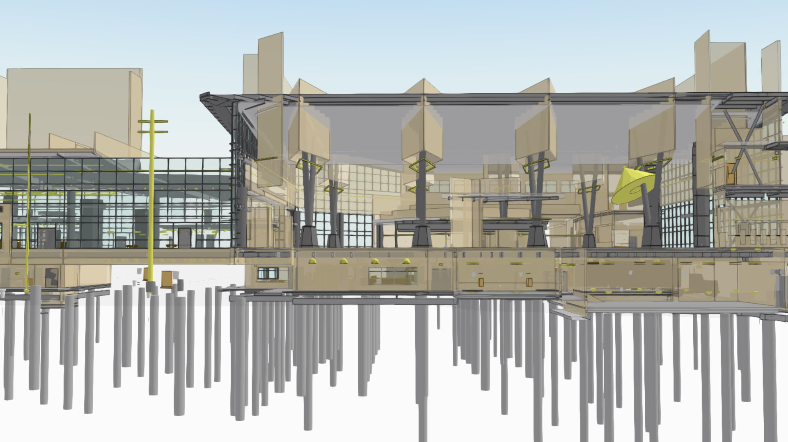
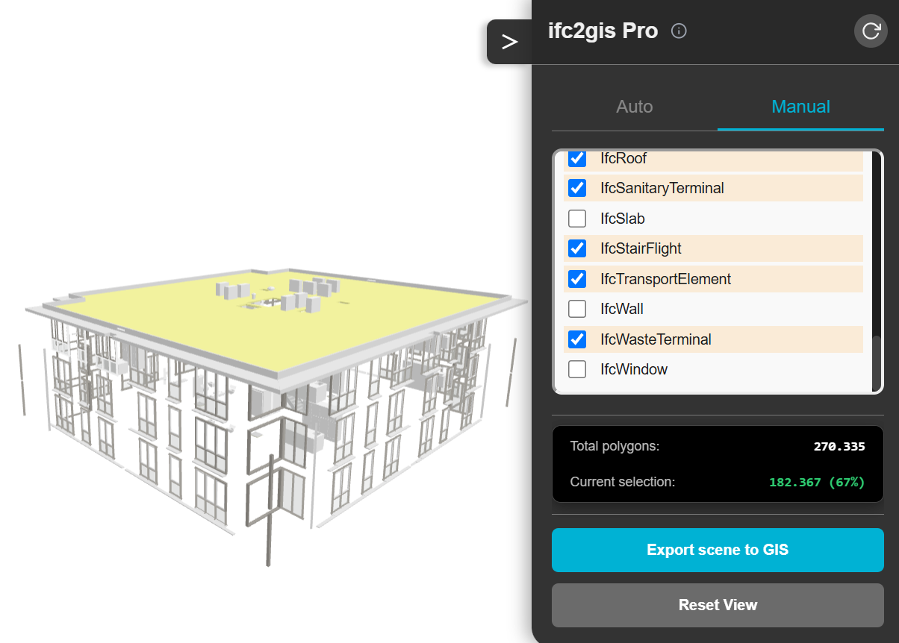
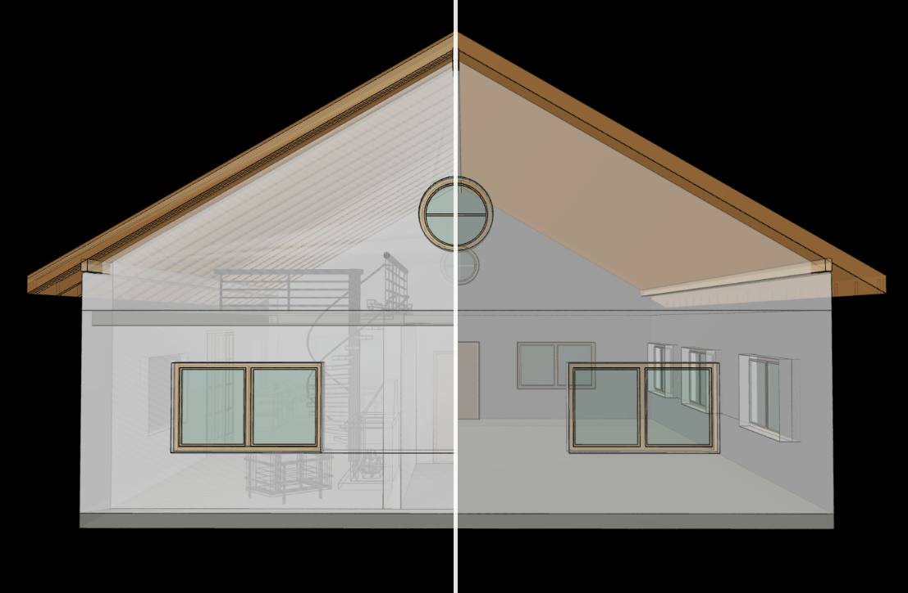
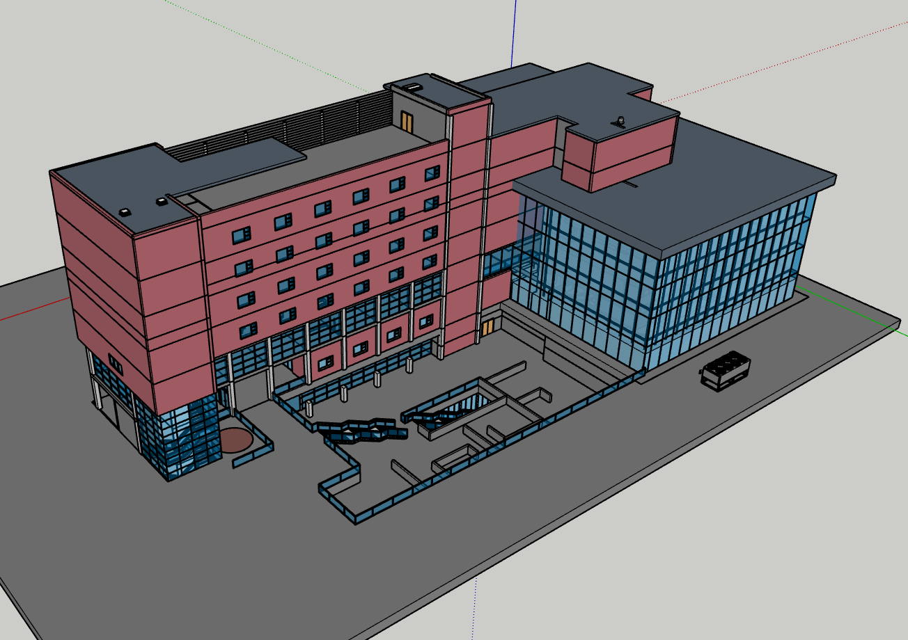
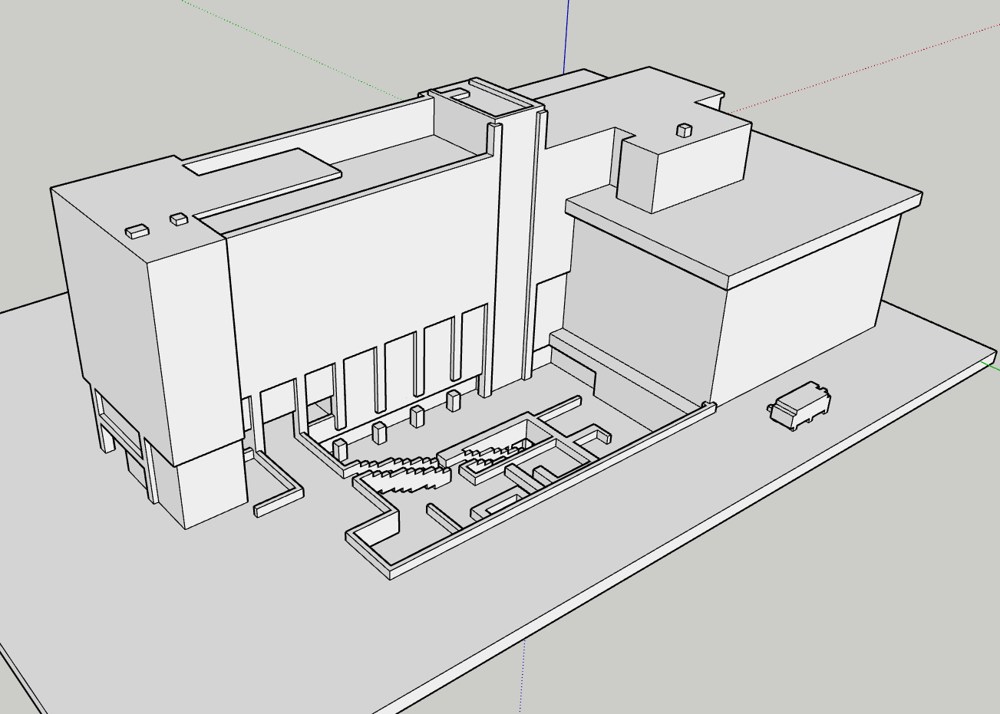
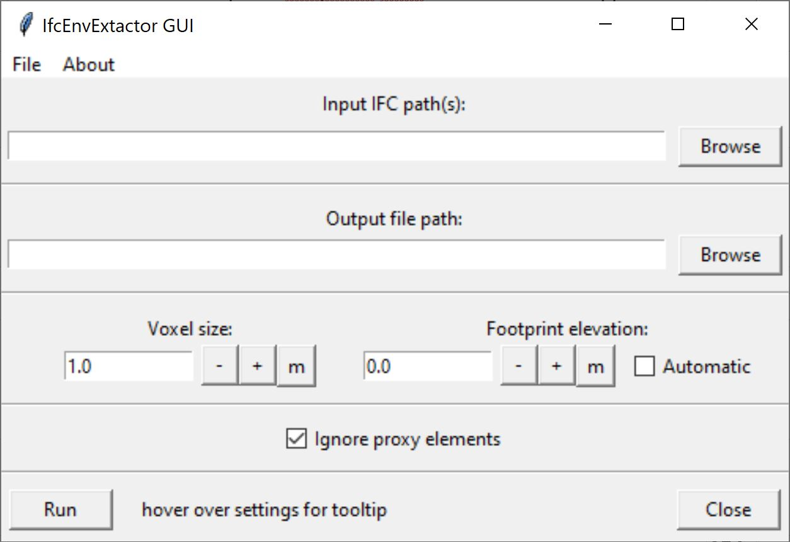
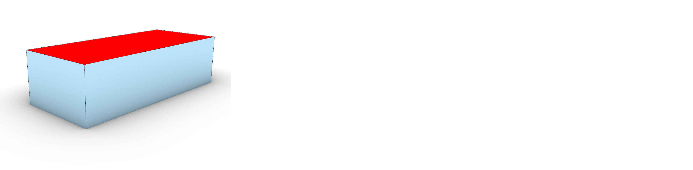
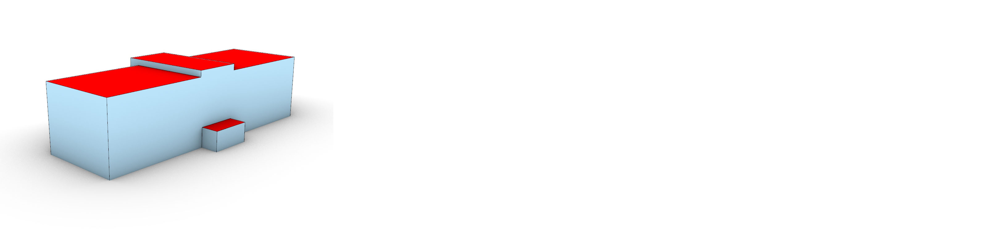
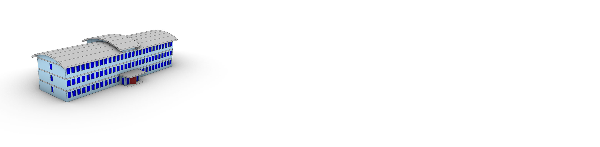

# Toepassingen

## Handleiding/HowTo

| Applicatie | BIM/IFC direct openen | 1:1 vertaling | Gefilterde 1:1 vertaling | Shell extractie | CityGML LoD support | CityJSON LoD support |
| - | - | - | - | - | - | - |
| ESRI ArcGIS Pro| ✅ | ✅ | ✅ | ❌ | ❌ | ❌ |
| IFC2GeoJSON | ❌ | ✅ | ✅ | ❌ | ❌ | ❌ |
| Save Software FME | ❌ | ✅ | ✅ | ❌ | ✅  | ❌ |
| IfcConvert | ❌ | ✅ | ✅ | ❌ | ❌ | ❌ |
| BIMShell | ❌ | ✅ | ✅ | ✅ | ❌ | ❌ |
| IfcEnvelopeExtractor | ❌ | ✅ | ✅ | ✅ | ✅ | ✅ |

✅ = volledige support
❌ = geen support

# BIM bestanden in GIS omgeving brengen

## ESRI ArcGIS Pro
In ESRI ArcGIS Pro zijn er tools beschikbaar om een bestaand BIM-model (IFC en Revit) om te zetten naar GEO. Er is tooling beschikbaar om BIM-modellen direct in de Esri software te laden. Een juiste geo-locatie te geven en te converteren naar een ESRI File GeoDataBase (.gdb). De beschikbaar tooling is beschreven op [Esri BIM en GIS](https://learn.arcgis.com/en/paths/bim-and-gis/) en op de [bimfile to geodatabase](https://doc.esri.com/en/arcgis-pro/latest/tool-reference/conversion/bimfile-to-geodatabase.html) webpagina's. 

Met deze tooling is het mogelijk een 1 op 1 vertaling van het BIM-model te maken. Wel zal de orginele geometrie vertaald worden naar een Multipatch zoals beschreven in deze [ARcGIS documentatie](https://doc.esri.com/en/arcgis-pro/latest/help/data/revit/adding-revit-data-to-arcgis-pro.html). De 

In de Esri-blog ["Common Patterns for BIM and GIS Integration"](https://www.esri.com/arcgis-blog/products/arcgis-pro/transportation/common-patterns-for-bim-and-gis-integration) staat beschreven dat het mogelijk is om alle informatie-uitwisseling via open standaarden (o.a. IFC en CityGML) plaats te laten vinden. Het converteren van gegevens van de ene standaard naar de andere kent vergelijkbare problemen als klassieke ETL-workflows. Dit leidt tot gegevensverlies, omdat bepaalde domein- of disciplinespecifieke informatie ontbreekt en omdat er verschillen zijn in de complexiteit waarmee geometrie wordt weergegeven. Het gegevensverlies kan nog groter worden wanneer gegevens vanuit een leveranciersspecifiek formaat via meerdere open standaarden worden geconverteerd en uiteindelijk weer in een ander leveranciersspecifiek formaat terechtkomen. Esri ondersteunt deze aanpak door 

Esri ondersteunt deze aanpak doorgaans door gebruik te maken van bibliotheken en tools van derden om gegevens in open standaarden te kunnen lezen. Waar mogelijk willen we het aantal stappen in de gegevensconversie vereenvoudigen door te kijken naar ELT-workflows en -tools, bijvoorbeeld door IFC in de toekomst rechtstreeks in ArcGIS te kunnen lezen.
There are other patterns of integration that we see evolving in the industry. One of them is the concept that all information exchange should happen through Standards. This includes specifications such as the Open Geospatial Consortium’s CityGML and IFC. This can be challenging when the standards were created for separate industries and workflows and only later attempted to be glued together. Converting data from one standard to another has similar issues to classic ETL workflows, resulting in data loss because of missing domain or discipline information and mismatch in graphic complexity. Data loss can be magnified when converting out of one vendor format, through multiple open standard formats, and then into another vendor format.

Given the need to evolve software and standards rapidly to meet changing market expectation and technology capability, it’s hard to see that this pattern is going to be able to stabilize in a manner that consistently minimizes data loss for most cross-industry applications of BIM and GIS integration. Esri typically supports these patterns by making use of third-party libraries and tools to read open standard data. Whenever possible, we hope to simplify the number of hops in data conversion by looking at ELT workflows and tools, such as by directly reading IFC into ArcGIS in the future.

<figure id="IFC-in-ArcGIS" style="display: block; text-align: center; margin: 0 auto;">
      
      <figcaption>
        <a class="self-link" href="#fig-ILS-IP-BUP-digigo"></bdi></a>
        
        IFC in ArcGIS in een 3D Object Scene Layers  
        Bron: <a href="https://www.esri.com/arcgis-blog/products/arcgis-pro/transportation/common-patterns-for-bim-and-gis-integration">Esri </a></a>
        
      </figcaption>
</figure>

## IFC2GeoJSON 
Het project [Ifc2GeoJSON](https://github.com/abdoulayediak/ifc2geojson) voorziet in tooling om IFC naar 3D GeoJSON te converteren. Ook is er een [ifc2gis-webapplicatie](https://ifc2gis.com/app/) van beschikbaar. 

<figure id="IFC-2-GIS" style="display: block; text-align: center; margin: 0 auto;">
      
      <figcaption>
        <a class="self-link" href="#fig-ILS-IP-BUP-digigo"></bdi></a>
        
        IFC in de tooling IFC2GIS met een selectie een gefilterde 1:1 vertaling 
        Bron: <a href="https://ifc2gis.com/">IFC2GIS </a></a>
        
      </figcaption>
</figure>

In deze tool wordt web-ifc, tree.js en geojson gebruikt om de geometrie te veranderen. De [IfcGeometryLoader](https://github.com/ThatOpen/engine_web-ifc/blob/main/src/cpp/web-ifc/geometry/IfcGeometryLoader.cpp) voorziet in de transformatie van impliciete procedurele geometrie naar expliciete geometrie. Met deze functie is het mogelijk om parameters mee te geven voor het tesseleren van geometrie. In de Ifc2GeoJSON tool is het niet mogelijk deze parameters aan te passen. 

## Save Software FME
FME software heeft verschillende functies beschikbaar om BIM naar GEO om te zetten. 

De functies onderscheiden in het detailniveau van het BIM-model en het detailniveau van de output. LOD 3 is hierbij het meest complex, omdat het geen n op 1, geen 1 op 1 maar een n op n mapping is.   

- [Simplifying IFC geometries for easier conversion](https://support.safe.com/hc/en-us/articles/25407765402637-Simplifying-IFC-geometries-for-easier-conversion)  
- [BIM to GIS IFC LOD 100 to LOD 2 CityGML](https://support.safe.com/hc/en-us/articles/25407431004173-BIM-to-GIS-Basic-IFC-LOD-100-to-LOD-2-CityGML)  
- [BIM to GIS IFC LOD 200 to LOD 3 CityGML](https://support.safe.com/hc/en-us/articles/25407525412365-BIM-to-GIS-Advanced-IFC-LOD-200-to-LOD-3-CityGML)
- [BIM to GIS IFC LOD 300 to LOD 4 CityGML](https://support.safe.com/hc/en-us/articles/25407718003341-BIM-to-GIS-Intermediate-IFC-LOD-300-to-LOD-4-CityGML)

In de totale flow van de LOD100 naar LOD 2 CityGML conversie is te zien dat er een mesh gemaakt wordt van de Ifc geometrie van spaces en slabs.  

<figure id="FME-LOD-2-workflow" style="display: block; text-align: center; margin: 0 auto;">
      
      <figcaption>
        <a class="self-link" href="#fig-LOD-2-CityGML-workflow"></bdi></a>
        
        FME LOD 2 CityGML workflow 
        Bron: <a href="https://support.safe.com/hc/en-us/articles/25407429026829-BIM-Tutorial">FME </a></a>
        
      </figcaption>
</figure>

De totale flow van de LOD200 naar LOD 3 CityGML conversie is het meest complex. Voor een gebouw wordt er wederom een LOD100 mesh gemaakt. dit wordt aangevuld met een [citygmlgeometrysetter](https://hub.safe.com/publishers/safe-lab/transformers/citygmlgeometrysetter). Hiermeek kan een bepaalde citygml lod geduid worden. Verschillende Ifc entiteiten resulteren in de flow in verschillende CityGML concepten. 

<figure id="FME-LOD-3-workflow" style="display: block; text-align: center; margin: 0 auto;">
      
      <figcaption>
        <a class="self-link" href="#fig-FME-LOD-3-workflow"></bdi></a>
        
        FME LOD 3 CityGML workflow 
        Bron: <a href="https://support.safe.com/hc/en-us/articles/25407429026829-BIM-Tutorial">FME </a></a>
        
      </figcaption>
</figure>

<figure id="FME-IFC-Input-model" style="display: block; text-align: center; margin: 0 auto;">
      
      <figcaption>
        <a class="self-link" href="#fig-FME-IFC-Input-model"></bdi></a>
        
        FME IFC Input model 
        Bron: <a href="https://support.safe.com/hc/en-us/articles/25407429026829-BIM-Tutorial">FME </a></a>
        
      </figcaption>
</figure>

<figure id="IFC-2-GIS" style="display: block; text-align: center; margin: 0 auto;">
      
      <figcaption>
        <a class="self-link" href="#fig-IFC-2-GIS"></bdi></a>
        
        FME LOD 2 CityGML output 
        Bron: <a href="https://support.safe.com/hc/en-us/articles/25407429026829-BIM-Tutorial">FME </a></a>
        
      </figcaption>
</figure>

<figure id="IFC-3-GIS" style="display: block; text-align: center; margin: 0 auto;">
      
      <figcaption>
        <a class="self-link" href="#fig-IFC-3-GIS"></bdi></a>
        
        FME LOD 3 CityGML output 
        Bron: <a href="https://support.safe.com/hc/en-us/articles/25407429026829-BIM-Tutorial">FME </a></a>
        
      </figcaption>
</figure>

<figure id="IFC-4-GIS" style="display: block; text-align: center; margin: 0 auto;">
      
      <figcaption>
        <a class="self-link" href="#fig-"IFC-4-GIS"></bdi></a>
        
        FME LOD 4 CityGML output 
        Bron: <a href="https://support.safe.com/hc/en-us/articles/25407429026829-BIM-Tutorial">FME </a></a> 
        
      </figcaption>
</figure>

## IfcConvert
[IFC convert](https://docs.ifcopenshell.org/ifcconvert.html#) is onderdeel van [IfcOpenShell](https://docs.ifcopenshell.org/). IfcOpenShell is een toolkit die ondersteunt bij het lezen, schrijven en bewerken van BIM met behulp van IFC. Met IfcConvert is het mogelijk om IFC te converteren naar formaten als .obj, .dae, .glb, .stp, .igs, .xml, .svg, .h5, .ttl, .ifc, .rdb en .json. 
Het is mogelijk om specifieke elementen wel of niet mee te nemen met de IFCConvert tool zoals beschreven in de [IfcConver Usage](https://docs.ifcopenshell.org/ifcconvert/usage.html). 

Het creëeren van CityJSON is onderzocht in samenwerking met de TU-Delft. Dit is onder andere beschreven in dit [githubissue](https://github.com/IfcOpenShell/IfcOpenShell/issues/2977). IfcConvert voorziet momenteel niet in CityJSON conversie. Wel is er een IfcCityJSON converter, maar deze converter converteert CityJSON naar IFC, en niet andersom. 

<figure id="IFC-Open-Shell-CityGML-Output" style="display: block; text-align: center; margin: 0 auto;">
      
      <figcaption>
        <a class="self-link" href="#fig-ILS-IP-BUP-digigo"></bdi></a>
        
        Ifc Open shell onderzoek naar OBJ en CityGML output vanuit IFC 
        Bron: <a href="https://github.com/IfcOpenShell/IfcOpenShell">IFCOpenShell Github</a></a>
        
      </figcaption>
</figure>

## BIMShell
BIMShell is een extensie van Trimble/Sketchup. Met deze extensie is het mogelijk om een footprint shell te maken. Dit genereert een omhulsel dat overeenkomt met de geëxtrudeerde voetafdruk van het model (langs de Z-as)

Daarnaast bestaat de Voxel Shell functie. 
Dit genereert een "gesloten benadering van de buitencontour van het model met behulp van een voxelgegevensstructuur. Hierbij kun je de voxelsresolutie instellen die wordt gebruikt om een omhulsel te maken. 

Een kleinere resolutie zorgt voor een nauwkeuriger resultaat, maar vereist meer rekenkracht. Als het model openingen bevat die groter zijn dan de gekozen resolutie, is de kans groot dat het proces ook vlakken aan de binnenkant van het model genereert. Over het algemeen levert deze methode echter eenvoudigere modellen op dan de oorspronkelijke modellen.

Tenslotte is er de Out Shell Faces 
Genereert een omhulselversie van het model door de vlakken die zich aan de buitenzijde bevinden te kopiëren. Hierbij kan de resolutie van het geoptimaliseerde raster worden ingesteld dat wordt gebruikt om vanaf de buitenzijde van het model stralen (rays) op het model af te vuren. Net als bij Voxel Shell geldt dat wanneer de binnen- en buitenruimte van het model niet goed van elkaar te onderscheiden zijn (bijvoorbeeld door openingen, een open deur of ramen), het resulterende omhullende model waarschijnlijk ook vlakken aan de binnenzijde zal bevatten.

<figure id="BIMShell-Input-Output" style="display: block; text-align: center; margin: 0 auto;">
      
      <figcaption>
        <a class="self-link" href="#fig-BIMShell-Input-Output"></bdi></a>
        
        BIMShell input and output model 
        Bron: <a href="https://extensions.sketchup.com/extension/cdd3801a-c15d-40f9-87c2-a729d55f60d4/bimshell">BIMShell SketchUp Extensions</a></a>
        
      </figcaption>
</figure>

<figure id="BIMShell-Input" style="display: block; text-align: center; margin: 0 auto;">
      
      <figcaption>
        <a class="self-link" href="#fig-BIMShell-Input"></bdi></a>
        
        BIMShell input model 
        Bron: <a href="https://extensions.sketchup.com/extension/cdd3801a-c15d-40f9-87c2-a729d55f60d4/bimshell">BIMShell SketchUp Extensions</a></a>
        
      </figcaption>
</figure>

<figure id="BIMShell-Output" style="display: block; text-align: center; margin: 0 auto;">
      
      <figcaption>
        <a class="self-link" href="#fig-BIMShell-Output"></bdi></a>
        
        BIMShell output model 
        Bron: <a href="https://extensions.sketchup.com/extension/cdd3801a-c15d-40f9-87c2-a729d55f60d4/bimshell">BIMShell SketchUp Extensions</a></a>
        
      </figcaption>
</figure>

## IfcEnvelopeExtractor

De IfcEnvelopeExtractor is een open source C++ applicatie die BIM modellen in de IFC encoding kan omzetten naar Wavefront OBJ, STEP en CityGML CityJSON. Deze omzetting is niet alleen een 1:1 omzetting van IFC naar een ander GIS bestandstype. De applicatie zet de geometrie van het input bestand om naar GIS representaties volgens de GIS syntax. De conversie volgt hierbij het LoD framework van [Biljecki et al.](https://pure.tudelft.nl/ws/portalfiles/portal/4377508/Biljecki2016to.pdf). Aanvullend zijn er een aantal experimentele LoDs en een 1:1 conversie beschikbaar. De tool support de conversie van IFC naar in totaal 17 verschillende LoDs, zie appendix ... voor meer informatie.

De applicatie is toegankelijk via de [GitHub pagina](https://github.com/tudelft3d/IFC_BuildingEnvExtractor). Hier zijn de source code en gecompilde executables beschikbaar. De gecompilde executables zijn beschikbaar voor zowel Windows als Linux (Ubuntu). Gedetaillerde informatie over de methodes die ontwikkeld zijn in de code om de conversie uit te voeren, kan worden gevonden in het [technische report](https://research.tudelft.nl/en/publications/bim2geo-converter/) van versie 0.2.6. Dit report is gebaseerd op een eerdere versie van de code, versie 0.3.x is de huidige versie, waarbij de dieper liggende logica gelijk of vergelijkbaar is gebleven.

Controle over de applicatie kan op twee manieren worden uitgeoefend, via een Graphical User Interface (GUI) of via een configuratie bestand (ConfigJSON). De GUI is makkelijker en sneller om mee te werken, zeker voor gebruikers die geen programmeer ervaring hebben. De GUI geeft echter enkel controle over een sub-set van alle beschikbare instellingen. Dit is gedaan om de menu's overzichtelijk te houden. De beschikbare instellingen zijn gekozen op basis van wat de meest gebruikte instellingen zijn. Als deze instellingen te beperkend zijn moet er met de ConfigJSON gewerkt worden. De ConfigJSON is een lijst met instellingen in een JSON encoding.

### Workflow

#### bestands correctie

Niet ieder model kan door de IfcEnvelopeExtractor direct verwerkt worden. De software applicatie is ontwikkeld om te werken op veel verschillende modellen, maar niet ieder probleem kan ontweken worden. Daarom moeten modellen mogelijk handmatige gecorrigeerd worden voordat ze kunnen worden verwerkt. Er zijn aantal onderwerpen waarvan het aangeraden wordt om te controleren/corrigeren voor verwerking. Als alleen de buitenkant van het gebouw/bouwwerkt geexporteerd/converteerd moet worden hoeft alleen de georeferentie en het IfcClass gebruik gechecked te worden. Als ook de binnenkant geexporteerd/converteerd moet worden is het ook aangeraden dat de IfcSpace hiërarchie en de IfcBuildingStorey gerelateerde objecten gechecked worden.

**Georeferencing**

De IfcEnvelopeExtractor neemt de georeferentie over van het IFC bestand. Dit betekend dat als het model correct gegeorefereerd is dat het GIS model direct op de correcte locatie zal worden geplaatst. Echter is de aanwezigheid en kwaliteit van de georeferentie in IFC niet altijd gegarandeerd. Applicaties zoals [IfcGref](https://ifcgref.bk.tudelft.nl/) maken het mogelijk om correcte georeferentie data van een bestand te controleren en eventueel toe te voegen of te corrigeren. De online versie van IfcGref kan IFC bestanden van maximaal 100mb verwerken. Als de bestanden zwaarder zijn dan 100mb kan vanaf de [GitHub pagina](https://github.com/tudelft3d/ifcgref) de code verkregen worden om de applicatie lokaal te gebruiken. De 100mb limiet is dan niet meer aanwezig.

**Class gebruik**

De IfcEnvelopeExtractor gebruikt maar een sub-set van de IfcClasses die beschikbaar zijn in een volledig IFC bestand. De classes die gebruikt worden zijn classes die tastbare objecten/geometrie vertegenwoordigen die ruimtes van elkaar scheiden. Bijvoorbeeld wanden, deuren en ramen. Deze objecten scheiden kamers van elkaar, maar ook de kamers binnen een gebouw en de lucht aan de buitenkant van een gebouw. Meubels en leidingen zijn ook tastbaar, maar scheiden niet ruimtes van elkaar, dus meestal spelen deze geen rol bij het overzetten van IFC naar GIS.

Standaard gebruikt de applicatie twaalf verschillende classes: IfcBeam, IfcColumn, IfcCovering, IfcCurtainWall, IfcDoor, IfcMember, IfcPlate, IfcRoof, IfcSlab, IfcWall, IfcWallStandardCase, IfcWindow classes. Deze kleine selectie uit de [700+ classes](https://standards.buildingsmart.org/IFC/RELEASE/IFC4/ADD2_TC1/HTML/link/alphabeticalorder-entities.htm) is voor de meeste gebouwen genoeg om een correcte extractie uit te voeren. Echter kan het zijn dat een gebouw andere classes gebruikt die belangrijk zijn voor de overzetting. In dat geval kan de lijst aangepast en/of uitgebreid worden via de GUI en de ConfigJSON. Ook zijn deze twaalf verschillende classes gekozen op basis van gebouwen, mogelijk hebben bruggen of tunnels andere eisen.

Deze filtering van object class is belangrijk om de processen die de applicatie uitvoert simpel te houden. Zelfs met correcte class selectie zijn dit zware processen die mogelijk traag en instabiel kunnen zijn. Het is daarom belangrijk dat de classes die geselecteerd zijn ook echt de functie uitvoeren waarvoor ze bedoeld waren. Als een IfcSlab wordt gebruikt om een weg te representeren die naast een gebouw ligt, dan heeft de applicatie maar een beperkte mogelijkheid om dit correct te detecteren als deel van de omligging en niet deel van het gebouw. Vaak zal dus deze weg worden gezien als deel van het gebouw, met alle gevolgen van dien. Een class waar vaak problemen mee optreden is de IfcBuildingElementProxy class. Deze class wordt vaak, incorrect, gebruikt voor alle objecten waarvan het onduidelijk is onder welke class ze eigenlijk behoren. De objecten die deze class gebruiken kunnen dus een combinatie zijn van voor de applicatie belangrijke en onbelangrijke objecten. De applicatie zal dus of deze objecten allemaal negeren (als er niet gefilterd wordt op IfcBuildingElementProxy) of allemaal gebruiken (als er wel gefilterd wordt op IfcBuildingElementProxy).

Het is belangrijk dat de classes in een bestand dus correct gebruikt worden. Alle classes die deel maken van een gebouw kunnen niet gebruikt worden om de omgeving te modelleren. Het gebruik IfcBuildingElementProxy wordt afgeraden. Als deze class wel gebruikt wordt, wordt het aangeraden om het gebruik ervan zoveel mogelijk te beperken. Ook is het belangrijk dat alle objecten die in die class gebruikt worden of wel belangrijk zijn voor de extractie, of allemaal onbelangrijk.

Als dit niet het geval is zal een IFC bestand met de hand moeten worden gecorrigeerd voordat de applicatie het bestand kan verwerken. Met de hand kunnen veel objecten verwijderd worden of de class type van een object veranderd worden.

**IfcSpace gebruik**

De IfcEnvelopeExtractor maakt het ook mogelijk om binnenruimtes te exporteren. Bij v3.0.x is dit nog steeds zwaar gebaseerd op de IfcSpace class in het IFC bestand. Een IFC bestand kan drie verschillende compositie type kamers hebben: COMPLEX, ELEMENT en PARTIAL. COMPLEX betekend dat de IfcSpace een groep of cluster van kamers/ruimtes representeert. ELEMENT betekend dat de IfcSpace een enkele kamer/ruimte representeert. PARTIAL betekend dat de IfcSpace een deel van een kamer/ruimte representeert. De applicatie gebruikt alleen de ELEMENT IfcSpace objecten.

In bijna ieder model waarbij kamers/ruimtes zijn gegroepeerd is de compositie type incorrect. Bijna alle IfcSpace objecten hebben type ELEMENT. Het maakt geen verschil of deze objecten gebruikt worden om daadwerkelijk een kamer/ruimte te representeren of om een groep kamers/ruimtes te groeperen. Vaak is dit niet de fout van de modelleur maar de fout van de BIM software. Applicaties zoals Revit zullen altijd incorrect IfcSpace objecten schrijven naar IFC.

Dit zorgt er helaas voor dat als er complexe groeperingen van ruimtes in een IFC bestand aanwezig zijn dat deze altijd met de hand zullen moeten worden gecorrigeerd als interieur  output gewild is. Als geen interieur output gewild is dan kunnen de foutive IfcSpace objecten negeert worden. Net zoals bij de tastbare objecten negeerd de applicatie objecten die niet direct nodig zijn.

**IfcBuildingStorey gerelateerde objecten**

De IfcEnvelopeExtractor maakt het mogelijk om verdiepingen of informatie gerelateerd aan de verdiepingen te exporteren. Voor LoD0.2 en LoD0.3 export word een horizontale doorsnede gemaakt door het gebouw om een oppervlakte, of groep van oppervlaktes te maken. Voor LoD0.2 wordt dit door alle gebruikte objecten van het IFC model gedaan. Maar voor de LoD0.3 doorsnede worden alleen de objecten gebruikt die via IfcRelContainedInSpatialStructure objecten aan de verdieping (IfcBuildingStorey) gerelateerd zijn.

Deze relatie tussen verdieping/IfcBuildingStorey en de andere producten is soms incorrect en moet gecorrigeerd worden als dat mogelijk is. Het beste is als dit direct gecorrigeerd kan worden in de bron waar de modellen vandaan komen. Als deze relatie verkeerd is in IFC dan is het waarschijnlijk ook incorrect in Revit, ArchiCAD of andere bron. Als het bronbestand niet beschikbaar is dan kan als alternatief een IFC editor gebruikt worden. Het veranderen van de relatie tussen objecten en verdiepingen is relatief makkelijk en door veel IFC editors ondersteunt.

Een groter probleem is als een object met de goede verdieping is gerelateerd maar zo hoog is dat het meer dan een enkele verdieping overbrugt. Over het algemeen wordt het afgeraden dit soort objecten in een IFC model te hebben. Er is tot nu toe geen oplossing voor dit probleem gevonden. Het is in theorie mogelijk om hetzelfde object via twee (of meer) verschillende IfcRelContainedInSpatialStructure te relateren aan twee (of meer) verschillende verdiepingen. Dit is echter geen standaardoplossing en de meeste IFC viewers en editors zullen hier niet goed mee omgaan.

#### Applicatie instellen

Zoals eerder vermeld kan de applicatie op twee manieren ingesteld worden, via de GUI en via de ConfigJSON. Als eerste behandelen we de GUI. Aanvullend worden via de ConfigJSON alle instellingen behandeld die niet via de GUI configureerbaar zijn.

**GUI**

 en een console (rechts). Via het menu kunnen de meest voorkomende instellingen worden aangepast. Via de console communiceerd de software met de gebruiker")

De GUI is opgedeeld in groepen van instellingen die aan elkaar gerelateerd zijn. In de afbeelding hierboven zijn de groepen weergegeven.

* A: Lint menu
  * Het inladen van config pre-sets
  * Zetten van voorkeuren
  * Samenvatting weergeven van JSON instellingen (ook als deze niet beschikbaar zijn in de GUI)
  * Verwijderen van JSON instellingen die niet beschikbaar zijn in de GUI
  * Locatie aangeven van .exe en default pre-sets
* B: Algemene I/O instellingen
  * Instellen van input en output locaties
* C: Verwachte output LoD en encoding
  * De verwachte LoD output
  * De verwachte format output aanvullend aan CityJSON
* D: Aanvullende instellingen
  * Interieur & exterieur output
  * Voetafdruk en Dakuitlijn output
  * voetafdruk getrimde volumetrische objecten
  * Het gebruik van het IsExternal IFC attribuut
* E: Numerieke parameters
  * De voxelgrootte (belangrijk voor ray-casting en filtering processen)
  * De voetafdrukhoogte
* F: Geometrische parameters
  * De gebruikte objecten
  * De simplificatie van de objecten
  * De precisie/tolerantie
  * Gebruik van voxel pre-filtering

Er is ook een simpele versie van de GUI beschikbaar. Deze is vooral gemaakt voor het laden van pre-set bestanden.

Een uitgebreide beschrijving van de GUI kan (in het engels) worden gevonden op de [GitHub van de EnvExtractor](https://github.com/tudelft3d/IFC_BuildingEnvExtractor/blob/master/Documentation/1_Gui.md).

**ConfigJSON**

#### Samenvoegen van GIS bestanden

De output van de BIM2Geo converter is een model van een enkel bouwwerk, of (afhankelijk van de BIM model) een relatief kleine cluster van gebowuen. Om dit model in de omgeving the plaatsen is het mogelijk om de CityJSON output samen te voegen met een CityJSON tegel van bijvoorbeeld de 3D bag. Op dit moment is het nog niet mogelijk om dit direct met de BIM2Geo converter te doen. Een alternatieve oplossing is het gebruiken van [cijo](https://github.com/cityjson/cjio) (CityJSON/io).

### Output specificatie

De IfcEnvelopeExtractor ondersteunt 12 verschillende "reguliere" LoD. Deze LoD volgen een aangepaste LoD framework dat zowel het framework van de CityGML2.0/3.0 standaard en van [Biljecki et al.](https://pure.tudelft.nl/ws/portalfiles/portal/4377508/Biljecki2016to.pdf) combineerd en op uitbreid. Een deel van de verschillen komt voort uit benodigde interpretatie van regels die niet duidelijk gedefinieerd zijn in de gebruikte/bestaande frameworks. Aanvullend is het framework van [Biljecki et al.](https://pure.tudelft.nl/ws/portalfiles/portal/4377508/Biljecki2016to.pdf) gebaseerd op modellen die zijn gemaakt op basis in-situ metingen gecombineerd met 2D polygonen. Hier zitten andere beperkingen aan dan aan modellen gebaseerd op BIM. Hierdoor zijn niet alle aspecten van het framework passend.

Een deel van de volgende samenvatting van de output kan ook worden gevonden in het technische rapport van de [IfcEnvelopeExtractor V0.2.6](https://repository.tudelft.nl/file/File_5924bb4a-a5e4-42ff-b1ed-48168728d12a?preview=1). Dit document geeft ook een uitgebreide uitleg over de methodes die zijn gebruikt om de abstractie modellen te creëren. Echter is versie V0.3.2 van de software beschikbaar tijdens het schrijven van dit document. V0.3.2 gebruikt een aantal andere regels en methodes. Daarnaast is ook de mogelijke output uitgebreid, LoD4 werd nog niet ondersteunt door v0.2.

Niet iedere LoD die beschikbaar is in het framework van [Biljecki et al.](https://pure.tudelft.nl/ws/portalfiles/portal/4377508/Biljecki2016to.pdf) wordt behandeld in deze lijst. Dat betekend niet dat ze niet belangrijk zijn, alleen dat de exctractor deze LoD niet als output genereerd.

#### LoD0.0

2D bounding box representatie van het input BIM model.

De representatie bestaat uit:

* Dak oppervlak
  * $n = 1$
  * Type: _RoofSurface_ of _+ProjectedRoofOutline_ als geen voetafdruk extractie is gekozen.
  * Het bovenoppervlak van de kleinst georiënteerde bounding box om het totale model heen.
* Grond/voetafdruk oppervlak
  * $n = 1$
  * Type: _GroundSurface_
  * Het bovenoppervlak van de kleinst georiënteerde bounding box alle objecten die +-0.5 m zijn geplaatst van de voetafdruk

#### LoD0.2

, de kamers (midden) en de verdiepingen (rechts) zijn los weergegeven")

Simpel 2.5D oppervlak representatie van het input BIM model waarbij ieder oppervlak een normaal richting heeft van (0,0,1). Het model is 2.5D tussen oppervlaktes van dezelfde bron. Overhangende delen zijn toegestaan tussen oppervlaktes die andere types hebben of een andere bron hebben (zoals verschillende verdiepingen).

De representatie bestaat uit:

* Dak oppervlak
  * $n \geq 1$
  * Type: _RoofSurface_ of _+ProjectedRoofOutline_ als geen voetafdruk extractie is gekozen.
  * Een oppervlak dat is gemaakt door alle top oppervlaktes van de dak structuur to projecteren op de xy vlak. De geprojecteerde oppervlaktes die tegen elkaar rusten worden samengevoegd. Deze oppervlaktes worden op de voetafdruk hoogte geplaatst als geen voetafdruk output wordt gegenereerd. Als er wel voetafdruk output wordt gegenereerd worden deze oppervlaktes op de max z hoogte van het BIM model geplaatst.
* Grond/voetafdruk oppervlak
  * $n \geq 1$
  * Type: _GroundSurface_
  * Een oppervlak dat is gemaakt door een sectie te maken door het hele IFC model ter hoogte van de voetafdruk z waarde. Horizontale oppervlaktes die dicht bij deze sectiehoogte liggen (±0.15m) worden ook aan deze selectie toegevoegd. De resulterende vlakke oppervlaktes worden samengevoegd. De binnenringen die schachten en vergelijkbare elementen representeren worden verwijderd. Deze representatie is identiek voor de LoD0.3 and 0.4 grond/voetafdruk oppervlak.
* Verdiepingsoppervlak
  * Als IFC bestand _IfcBuildingStorey_ objecten bevat $n \geq 1$ anders $n = 0$.
  * Type: _FloorSurface_
  * Oppervlaktes die zijn gemaakt door een sectie te maken door het hele IFC model ter hoogte van iedere verdieping. Horizontale oppervlaktes die dicht bij deze sectiehoogte liggen (±0.15m) worden ook aan deze selectie toegevoegd. De resulterende vlakke oppervlaktes worden samengevoegd.
* Kamer oppervlak
  * Als IFC bestand _IfcSpace_ objecten bevat $n \geq 1$ anders $n = 0$.
  * Type: _+ProjectedCeilingOutline_
  * Oppervlaktes die zijn gemaakt door, per kamer, de plafond oppervlaktes plat te projecteren op de minimale z hoogte van de kamer. Deze vlakke oppervlaktes worden samengevoegd om een oppervlak te maken per kamer.

#### LoD0.3

 en de verdiepingen (rechts) zijn los weergegeven")

2.5D oppervlak representatie van het input BIM model waarbij ieder oppervlak een normaal richting heeft van (0,0,1). Het model is 2.5D tussen oppervlaktes van dezelfde bron. Overhangende delen zijn toegestaan tussen oppervlaktes die andere types hebben of een andere bron hebben (zoals verschillende verdiepingen).

De representatie bestaat uit:

* Dak oppervlak
  * $n \geq 1$
  * Type: _RoofSurface_
  * Oppervlaktes die zijn gemaakt op basis van de dak structuur van het input model. De top oppervlaktes van het dak worden geïsoleerd en gegroepeerd als ze elkaar aanraken of snijden. Per groep wordt een plat oppervlak gemaakt door deze groepen plat te projecteren, samen te voegen en op de top z hoogte te plaatsen van de originele groep. Overlap tussen de verschillende oppervlaktes wordt geëlimineerd door de lager gelegen oppervlaktes te trimmen.
* Grond/voetafdruk oppervlak
  * $n \geq 1$
  * Type: _GroundSurface_
  * Een oppervlak dat is gemaakt door een sectie te maken door het hele IFC model ter hoogte van de voetafdruk z waarde. Horizontale oppervlaktes die dicht bij deze sectiehoogte liggen (±0.15m) worden ook aan deze selectie toegevoegd. De resulterende vlakke oppervlaktes worden samengevoegd. De binnenringen die schachten en vergelijkbare elementen representeren worden verwijderd. Deze representatie is identiek voor de LoD0.2 and 0.4 grond/voetafdruk oppervlak.
* Verdiepings oppervlak
  * Als IFC bestand _IfcBuildingStorey_ objecten bevat $n \geq 1$ anders $n = 0$.
  * Type: _FloorSurface_ en _OuterFloorSurface_
  * Oppervlaktes die zijn gemaakt door een sectie te maken door het hele IFC model ter hoogte van iedere verdieping. Horizontale oppervlaktes die dicht bij deze sectiehoogte liggen (±0.15m) worden ook aan deze selectie toegevoegd. Voor ieder oppervlak wordt getest of het binnen of buiten het gebouw ligt. Per group worden de vlakke oppervlaktes worden samengevoegd.

#### LoD0.4

2.5D oppervlak representatie van het input BIM model waarbij ieder oppervlak dezelfde vorm behoud als de geometrische bron. Het model is 2.5D tussen oppervlaktes van dezelfde bron. Overhangende delen zijn toegestaan tussen oppervlaktes die andere types hebben of een andere bron hebben (zoals verschillende verdiepingen).

De representatie bestaat uit:

* Dak oppervlak
  * $n \geq 1$
  * Type: _RoofSurface_
  * Oppervlaktes die zijn gemaakt op basis van de dak structuur van het input model. De top oppervlaktes van het dak worden geisoleerd en gegroepeerd als ze elkaar aanraken of snijden. Overlap tussen de verschillende oppervlaktes wordt geelimineerd door de lager gelegen oppervlaktes te trimmen.
* Grond/voetafdruk oppervlak
  * $n \geq 1$
  * Type: _GroundSurface_
  * Een oppervlak dat is gemaakt door een sectie te maken door het hele IFC model ter hoogte van de voetafdruk z waarde. Horizontale oppervlaktes die dicht bij deze sectiehoogte liggen (±0.15m) worden ook aan deze selectie toegevoegd. De resulterende vlakke oppervlaktes worden samengevoegd. De binnenringen die schachten en vergelijkbare elementen representeren worden verwijderd. Deze representatie is identiek voor de LoD0.2 and 0.3 grond/voetafdruk oppervlak.

#### LoD1.0

3D bounding box representatie van het input BIM model.

De representatie bestaat uit:

* Buitenschil
  * $n = 1$
  * Type: _RoofSurface_, _GroundSurface_ of _WallSurface_
  * De kleinst georiënteerde bounding box om het totale model heen.

#### LoD1.2

 en de kamers (rechts) zijn los weergegeven")

2.5D volumetrische representatie van het input BIM model met unform vlakke boven en onder oppervlaktes.

De representatie bestaat uit:

* Buitenschil
  * $n \geq 1$
  * Type: _RoofSurface_, _GroundSurface_ of _WallSurface_
  * Volume kan gemaakt worden op twee manieren:
    * door het LoD0.2 dakoppervlak naar de grondhoogte te extruderen
    * door het LoD0.2 grondoppervlak naar de tophoogte van het gebouw te extruderen.
* Binnenschil
  * Als IFC bestand _IfcBuildingStorey_ objecten bevat $n \geq 1$ anders $n = 0$.
  * Type: _CeilingSurface_, _FloorSurface_ of _InteriorWallSurface_
  * Volume dat per kamer is gemaakt door de LoD0.2 _+ProjectedCeilingOutline_ represenatie te extruderen naar de tophoogte van de kamer.

#### LoD1.3

2.5D volumetrische representatie van het input BIM model met vlakke oppervlaktes. Ieder oppervlak heeft een normaal richting met een z-component dat gelijk is aan 1 of 0.

De representatie bestaat uit:

* Buitenschil
  * $n \geq 1$
  * Type: _RoofSurface_, _GroundSurface_ of _WallSurface_
  * Volume dat is gemaakt door de LoD0.3 dakoppervlaktes naar de grondhoogte te extruderen. De resulterende volumes worden samengevoegd. Het is mogelijk om dit volume bij te trimmen zodat de voetafdruk van dit volume overeen komt de de LoD0.2 voetafdruk.

#### LoD2.2

 en de kamers (rechts) zijn los weergegeven")

2.5D volumetrische representatie van het input BIM model.

De representatie bestaat uit:

* Buitenschil
  * $n \geq 1$
  * Type: _RoofSurface_, _GroundSurface_ of _WallSurface_
  * Volume dat is gemaakt door de LoD0.4 dakoppervlaktes naar de grondhoogte te extruderen. De resulterende volumes worden samengevoegd. Het is mogelijk om dit volume bij te trimmen zodat de voetafdruk van dit volume overeen komt de de LoD0.2 voetafdruk.
* Binnenschil
  * Als IFC bestand _IfcBuildingStorey_ objecten bevat $n \geq 1$ anders $n = 0$.
  * Type: _CeilingSurface_, _FloorSurface_ of _InteriorWallSurface_
  * Volume dat per kamer is gemaakt door de plafondoppervlaktes van de kamer te extruderen naar de minimale vloer hoogte van de kamer.

#### LoD3.2

 en de kamers (rechts) zijn los weergegeven")

3D volumetrische representatie van het input BIM model.

De representatie bestaat uit:

* Buitenschil
  * $n \geq 1$
  * Type: _RoofSurface_, _GroundSurface_, _WallSurface_, _Window_ of _Door_
  * Volume dat is gemaakt door alle (deels) externe oppervlaktes te filteren met behulp van raycasting. Deze oppervlaktes worden met elkaar getrimd en de getrimde delen die aan de buitenkant van het gebouw liggen worden samengevoegd.
* Binnenschil
  * Als IFC bestand _IfcBuildingStorey_ objecten bevat $n \geq 1$ anders $n = 0$.
  * Type: _CeilingSurface_, _FloorSurface_ of _InteriorWallSurface_
  * Volume dat per kamer is gemaakt door de IfcSpace vorm over te nemen.

#### LoD4.0

3D complex (geen schil) representatie van de objecten die de buitenkant van het input BIM model representeren. Dit kan worden gezien als de eerste stap in de creatie van LoD3.2. Waarbij LoDe.1 stap 2 is.

De representatie bestaat uit:

* Complex
  * $n \geq 1$ 
  * Type: ieder IfcClass type dat in het model zit met voorafgaand een "+". Zoals bijvoorbeeld _IfcWall_ ->  _+IfcWall_
  * Groep van volumes die op twee verschillende manieren kan zijn verzameld:
    * Optie 1: Door de ruimte scheidende IFC objecten met het attribuut _IsExternal = True_ te verzamelen.
    * Optie 2: Door met behulp van voxel assisted ray-casting de externe IFC objecten te verzamelen.

#### LoD4.1

3D complex (geen schil) representatie van de ruimte scheidende objecten van het input BIM model.

De representatie bestaat uit:

* Complex
  * $n \geq 1$
  * Type: ieder IfcClass type dat in het model zit met voorafgaand een "+". Zoals bijvoorbeeld _IfcWall_ ->  _+IfcWall_
  * Groep van volumes die is verzameld door de IFC objecten die zijn gekozen als ruimte scheidende objecten 1:1 over te zetten.

#### LoD4.2

3D complex (geen schil) representatie van van het input BIM model.

De representatie bestaat uit:

* Complex
  * $n \geq 1$
  * Type: ieder IfcClass type dat in het model zit met voorafgaand een "+". Zoals bijvoorbeeld _IfcWall_ ->  _+IfcWall_
  * Groep van volumes die is verzameld door de IFC objecten 1:1 over te zetten. Deze abstractie gebruikt geen versimpelde representatie van de ramen en deuren zoals de rest van de abstractie wel doet.

#### LoDe.1

3D oppervlak representatie van het input BIM model. Dit kan worden gezien als de tweede stap in de LoD3.2 creatie. LoD4.0 kan worden beschouwd als de eerste stap.

De representatie bestaat uit:

* Buitenschil
  * $n \geq 1$
  * Type: _RoofSurface_, _GroundSurface_, _WallSurface_, _Window_ of _Door_
  * een verzameling oppervlakken die wordt gecreëerd door de LoD4.0-objecten te nemen en de buitenste oppervlakken te isoleren met behulp van een raycasting-proces. Dit is niet een volumetrisch model.

#### LoD5.0/LoDv

3D voxelisatie representatie van het model.

De representatie bestaat uit:

* Buitenschil
  * $n \geq 1$
  * Type: _RoofSurface_, _GroundSurface_, _WallSurface_, _Window_ of _Door_
  * Volume dat is gemaakt door alle externe oppervlaktes van de voxelisatie te isoleren. Op basis van van de soort IFC objecten die de voxels snijden kunnen deze oppervlaktes een type gegeven worden. oppervlaktes met hetzelfde type worden samengevoegd.
* Binnenschil
  * $n \geq 1$.
  * Type: geen types geimplementeerd
  * Volume dat per kamer is door alle interne oppervlaktes van de voxelisatie te isoleren. Dit is niet gebaseerd op de IfcSpace objecten maar de ruimte scheidende objecten. De naam en attributen van de kamer kan wel worden gebaseerd op de IfcSpace objecten.

## IFC2GeoJSON
