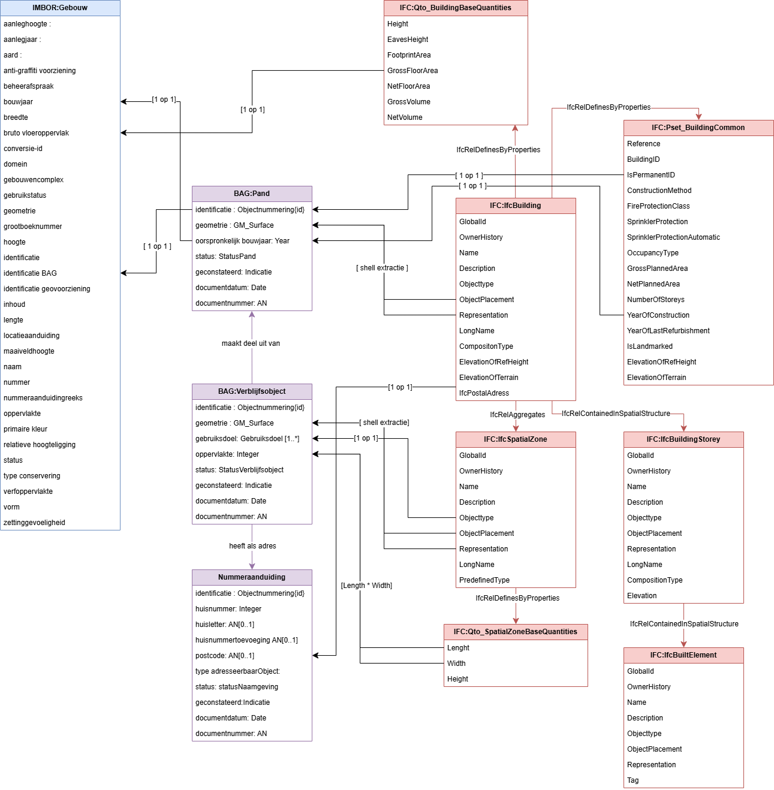

# Entiteit en Attribuutmapping tussen BIM en GEO

<figure id="Attribuut_mapping_IFC_BAG_IMBOR" style="display: block; text-align: center; margin: 0 auto;">
      
      <figcaption>
        <a class="self-link" href="#fig-Attribuut_IMBOR_gebouw"></bdi></a>
        
        Attribuut mapping van een IFC-entiteiten en attributen naar BAG-entiteiten en attributen en IMBOR-entiteiten en attributen. 
      </figcaption>
</figure>

<figure id="ADE_voor_IFC_in_CitygML" style="display: block; text-align: center; margin: 0 auto;">
      
      <figcaption>
        <a class="self-link" href="#fig-Attribuut_IMBOR_gebouw"></bdi></a>
        
        ADE voor CityGML om IFC te borge
      </figcaption>
</figure>