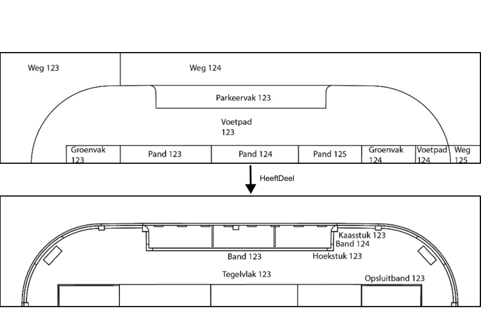
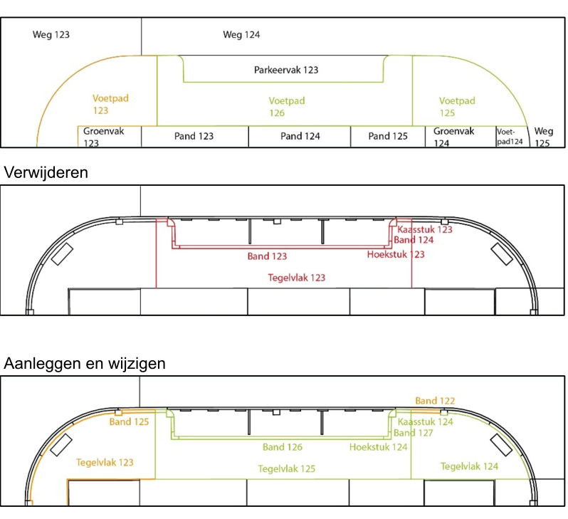
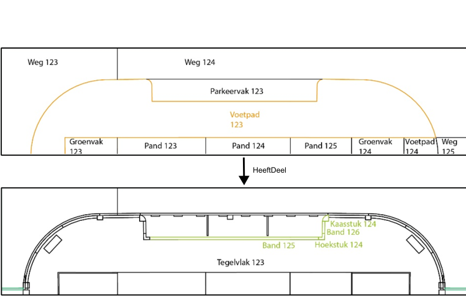

# Levenscyclus

Onderstaande beelden visualiseren de flow van wijzigingen bij BIM en GEO. 

De flow is gebaseerd op de [levensduur en historie van de bgt](https://docs.geostandaarden.nl/imgeo/catalogus/bgt/#levensduur-en-historie). 


## Situatie

Stel men heeft in Geo de volgende entiteitinstanties: 

Weg 123, Weg 124, Weg 125, Parkeervak 123, Voetpad 123, Voetpad 124, Groenvak 123, Groenvak 124, Pand 123, Pand 124 en Pand 125.

En stel men heeft in BIM entiteitsinstanties op een lager decompositieniveau (kleinere onderdelen):

Tegelvlak 123, Band 123, Band 124, Hoekstuk 123, Kaaststuk 123 en Opsluitband 123.

En stel men heeft een connectie gemaakt tussen BIM en GEO.

<figure id="Situatie_weg_en_elementen">
      
    <figcaption><a class="self-link" href="#fig-Situatie_weg_en_elementen"></bdi></a><span class="fig-title">Wegen die bestaan uit weginrichtingselementen</span></figcaption>
</figure>

## Vervangen van elementen

Men zou elementen van het voetpad kunnen vervangen. In onderstaande situatie is een wijziging aangebracht:  
- Band 123 is verwijderd en Band 125 is aangelegd (1 op 1 vervanging).
- Band 124 is verwijderd en Band 126 is aangelegd (1 op 1 vervanging).
- Hoekstuk 123 is verwijderd en Hoekstuk 124 is aangelegd (1 op 1 vervanging).
- Kaasstuk 123 is verwijderd en Kaasstuk 124 is aangelegd (1 op 1 vervanging). 

Als deze maatregelen zijn *Uitgevoerd*.

In de huidige bgt zit geen koppeling tussen een BGT-object en de objecten waaruit deze kan bestaan. Voetpad 123 blijft in dat geval bestaan. 

Bij een koppeling tussen bgt-objecten en de objecten waaruit deze bestaat blijft Voetpad 123 bestaan, maar krijgt een nieuwe versie. 

versie huidig:
```rdf 
example:voetpad_123 nen2660:haspart 
    example:band_123, 
    example:band_124, 
    example:hoekstuk_123, 
    example:kaaststuk_123 .
```
versie nieuw:
```rdf 
example:voetpad_123 nen2660:haspart 
    example:band_125, 
    example:band_126, 
    example:hoekstuk_124, 
    example:kaaststuk_124 .
```

<figure id="Vervangen_van_elementen">
      
    <figcaption><a class="self-link" href="#fig-Vervangen_van_elementen"></bdi></a><span class="fig-title">Verandering in Wegen die bestaan uit weginrichtingselementent door vervanging weginrichtingselementen</span></figcaption>
</figure>

## Nieuwe weg in een bestaande weg

Men zou een nieuw voetpad kunnen maken. In onderstaande situatie is een nieuw voetpad gemaakt door: 
- Een deel van Tegelvlak 123 wordt verwijderd en tegelvlak 125 is aangelegd. 
  - Een bestaand blijvend deel van Tegelvlak 123 blijft Tegelvlak 123, Het ander bestaand blijvend deel wordt Tegelvlak 124 omdat deze niet aangesloten zit aan tegelvlak 123.   
- Band 123 is verwijderd en Band 126 is aangelegd (1 op 1 vervanging).
- Band 124 is verwijderd en Band 127 is aangelegd (1 op 1 vervanging).
- Hoekstuk 123 is verwijderd en Hoekstuk 124 is aangelegd (1 op 1 vervanging).
- Kaasstuk 123 is verwijderd en Kaasstuk 124 is aangelegd (1 op 1 vervanging). 

Als deze maatregelen zijn *Uitgevoerd*.

Dan blijft het Voetpad 123 bestaan, maar krijgt een nieuwe versie en geometrie. Voetpad 125 ontstaat als nieuw object met de attributen en waarden van Voetpad 123. Voetpad 126 ontstaat met nieuwe attributen.   

<figure id="Nieuwe_weg_in_een_bestaande_weg">
      
    <figcaption><a class="self-link" href="#fig-Nieuwe_weg_in_een_bestaande_weg"></bdi></a><span class="fig-title">Verandering in Wegen die bestaan uit weginrichtingselementent door een nieuwe weg in een bestaande weg</span></figcaption>
</figure>

## Nieuwe weg in een bestaand onbegroeid terrein

Men zou nieuwe wegen kunnen maken in bestaand onbegroeid terrein. In onderstaande situatie is een nieuw situatie gemaakt door: 
- Onbegroeid terreindeel 123 is verwijderd en Teglvlak 123, 124 Band 125, 126, Hoekstuk 124, Kaasstuk 124 etc. wordt aangelegd. 

Als deze maatregelen zijn *Uitgevoerd*.

Dan onstaan Weg 123, 124, 125, Voetpad 123, 124 Parkeervak 123, etc. 

<figure id="Nieuwe_weg_in_een_onbegroeid_terrein">
      
    <figcaption><a class="self-link" href="#fig-Nieuwe_weg_in_een_onbegroeid_terrein"></bdi></a><span class="fig-title">Nieuwe weg in een onbegroeid terrein</span></figcaption>
</figure>
