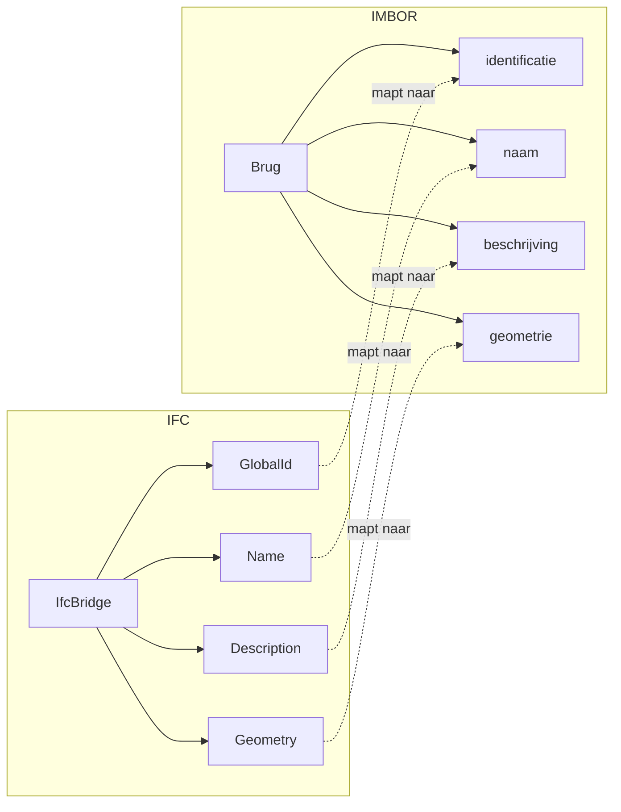

# IFC naar IMBOR Mapping

Deze sectie beschrijft de **semantische mapping** van **IFC 4.3** naar **IMBOR 2025** (InformatieModel Beheer Openbare Ruimte). In tegenstelling tot de CityGML-mapping, richt deze mapping zich op **beheeraspecten** van infrastructurele objecten.

De mapping is uitgewerkt voor:
- **Entiteiten (klassen)**: Brug (Vaste en beweegbare), Dek, Pijler
- **Attributen (properties)**: Attributen uit de IMBOR Startset

## Mermaid Diagram: Attribuutflow

